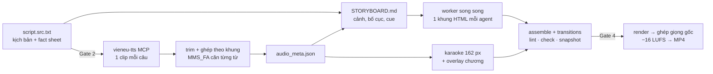

# abm-video-bgdt: video bài giảng điện tử tiếng Việt do agent dựng

**abm-video-bgdt** là một *agent skill*: một bộ hướng dẫn và công cụ giúp một coding agent (Claude Code và các agent đọc được
`SKILL.md`) tự làm một video bài giảng tiếng Việt 16:9, dài 3–15 phút, từ ý tưởng đến file MP4. Video có:
- giọng đọc tự nhiên từ [VieNeu-TTS](https://github.com/pnnbao97/VieNeu-TTS);
- chữ karaoke hiện từng từ khớp giọng ở 15 % dưới cùng;
- hình động thay đổi liên tục, xuất hiện đúng lúc giọng nói nhắc tới.

Hình được dựng bằng [HyperFrames](https://hyperframes.heygen.com) (HTML + GSAP → video).

> English summary at the [end of this page](#in-english).

| | |
|---|---|
|  |  |
|  |  |

*Khung hình từ hai video đã giao: "Hermes Agent – từ cơ bản đến nâng cao" (10:12, 63 khung) và "Claude – từ cơ bản đến chuyên sâu" (14:35, 79 khung).*

## Skill làm được gì

- **Từ chủ đề đến MP4**, qua 8 giai đoạn có kiểm tra tự động: nghiên cứu nguồn, kịch bản, giọng đọc, căn thời gian từng từ,
  storyboard, dựng khung song song, QA, render.
- **Giọng đọc tiếng Việt** qua MCP `vieneu-tts`, mỗi câu một clip, sau đó căn thời gian từng từ bằng MMS_FA
  (tỉ lệ khớp 156/156 câu ở video đầu).
- **Karaoke khớp tiếng:** mỗi câu hiện trọn, từng từ sáng dần theo giọng; độ lệch đo được tối đa 0,022 s.
- **Chống nhàm chán:**
  - danh mục 20 loại cảnh;
  - kho 12 mảnh ghép bố cục để biến tấu, được khuyến khích tự sáng tác bố cục `custom-*`;
  - lint cảnh báo khi hình lặp lại.
- **Chuẩn DNA BGĐT** (Hook → Core → Case → Action), với 6 thẻ sư phạm: Mục tiêu chương, Nguyên lý cốt lõi, Cách sai · Cách đúng,
  Tình huống, Bài tập nhanh 5 phút, Câu hỏi tình huống.
- **4 cổng duyệt của người dùng:** phát âm và nhịp đọc, kịch bản (trước khi tạo giọng), kiểu karaoke, bản nháp (trước bản cuối).
- **Giao hàng đúng chuẩn:** 1920×1080, −16 LUFS, file `chapters.txt` cho YouTube/LMS, bản 720p gửi điện thoại, báo cáo QA.
- **Theme ABM tùy chọn** (Navy #030548, vàng cam #F9B508, Montserrat) và bước dọn file trung gian sau khi giao.

## Cách hoạt động



Skill dựa trên workflow `faceless-explainer` của HeyGen HyperFrames và thay hai bước của nó: giọng đọc (VieNeu thay cho
TTS của HeyGen) và phụ đề (karaoke 15 % thay cho phụ đề 180 px). Tất cả thông số riêng của một bài nằm trong
`video.config.json`, nên không script nào chứa giá trị cứng.

## Yêu cầu

| Thành phần | Phiên bản đã chạy | Ghi chú |
|---|---|---|
| Hệ điều hành | Windows 11 | Script chính là PowerShell 7; các đường dẫn đổi được bằng biến môi trường |
| Node.js | 24.x (≥ 20) | chạy script `.mjs` và `npx hyperframes` |
| PowerShell | 7.6 | `run-pipeline.ps1` |
| ffmpeg / ffprobe | 9.0 | trim, ghép, loudnorm, ảnh xem trước |
| uv + Python | uv 0.12, Python ≥ 3.12 | VieNeu-TTS và MCP server |
| HyperFrames CLI | **0.7.99** (ghim) | gọi qua `npx -y hyperframes@0.7.99` |
| GPU NVIDIA (khuyến nghị) | GTX 1080 | TTS chạy được trên CPU nhưng chậm; lần đầu tải model MMS_FA khoảng 1,2 GB |
| Mạng | – | GSAP tải từ jsDelivr khi render |

## Cài đặt cho một agent

### 1. Cài skill

Clone repo vào thư mục skill của agent:

```bash
git clone https://github.com/abm-dungtq/abm-video-bgdt.git ~/.claude/skills/abm-video-bgdt
```

- **Claude Code:** thư mục như trên. Skill tự được gọi khi bạn nói "làm video bài giảng…", hoặc gọi thẳng `/abm-video-bgdt`.
- **Agent khác đọc `SKILL.md`:** đặt vào thư mục skill mà agent đó quét (ví dụ `~/.agents/skills/abm-video-bgdt`), hoặc bảo agent
  đọc `SKILL.md` trước khi làm.

### 2. Cài skill HyperFrames của HeyGen

```bash
npx -y hyperframes@0.7.99 skills update faceless-explainer
```

Lệnh này cài `faceless-explainer` và các skill lõi vào `~/.agents/skills`. Skill này chỉ đọc chúng, không sửa.

### 3. Cài VieNeu-TTS và MCP server

```bash
git clone https://github.com/pnnbao97/VieNeu-TTS.git
cd VieNeu-TTS
uv sync --extra cuda          # bỏ --extra cuda nếu chạy CPU
uv pip install torchaudio uroman
```

MCP server nằm trong repo này, ở `mcp/vieneu-tts/`. Khởi động API giọng đọc (lần đầu tải model mất khoảng 40 s) và để nó chạy:

```powershell
$env:VIENEU_REPO = "D:\path\to\VieNeu-TTS"
pwsh ~/.claude/skills/abm-video-bgdt/mcp/vieneu-tts/start-api.ps1
```

Đăng ký MCP với agent. Với Claude Code, thêm vào `.mcp.json` của thư mục làm việc:

```json
{
  "mcpServers": {
    "vieneu-tts": {
      "type": "stdio",
      "command": "uv",
      "args": ["run", "--directory", "<đường-dẫn>/abm-video-bgdt/mcp/vieneu-tts", "python", "server.py"],
      "env": { "VIENEU_API_URL": "http://127.0.0.1:8000", "PYTHONIOENCODING": "utf-8" }
    }
  }
}
```

MCP có 4 công cụ: `list_voices`, `text_to_speech`, `clone_voice` và `server_status`. Giọng mặc định của skill là **Thanh Bình**.

### 4. Biến môi trường (tùy chọn)

| Biến | Mặc định | Dùng cho |
|---|---|---|
| `VIENEU_VENV` | `D:/TQD/Claude-Video/VieNeu-TTS` | thư mục VieNeu-TTS để `uv run` các bước căn thời gian |
| `VIENEU_REPO` | `../VieNeu-TTS` cạnh `start-api.ps1` | nơi `start-api.ps1` khởi động API |
| `HF_SKILLS_DIR` | `~/.agents/skills` | nơi đặt skill HyperFrames |
| `HF_CACHE_DIR` | `<project>/../../.hf-cache` | cache khung hình khi render |

Máy khác máy tác giả thì nên đặt `VIENEU_VENV` trỏ tới bản clone VieNeu-TTS của bạn.

### 5. Kiểm tra cài đặt

```bash
node ~/.claude/skills/abm-video-bgdt/scripts/new-project.mjs videos/thu-nghiem --title "Bài thử"
cd videos/thu-nghiem
node tools/build-design-kit.mjs
node tools/fixture-check.mjs           # phải in: fixture-check ok
```

`fixture-check` dựng một dự án 2 khung, chạy `assemble` → `transitions` → `lint` → `check` → `snapshot` với CLI đang ghim, để
chứng minh máy của bạn dựng được video trước khi làm bài thật.

## Dùng skill

Nói với agent, ví dụ:

> Làm video bài giảng 10 phút giới thiệu về *<chủ đề>* cho học viên mới, giọng Thanh Bình, theo chuẩn DNA BGĐT.

Agent sẽ đi theo `SKILL.md`:

| # | Giai đoạn | Kết quả |
|---|---|---|
| 0 | Tạo dự án | `new-project.mjs` (thêm `--theme abm-brand` nếu muốn nhận diện ABM) |
| 1 | Thử giọng | **Gate 1**: phát âm thuật ngữ, nhịp đọc |
| 2 | Nguồn và kịch bản | fact sheet `[F-NN]`, `script.src.txt`; **Gate 2**: duyệt kịch bản |
| 3 | Giọng đọc | TTS qua MCP, căn thời gian từng từ, `audio_meta.json` |
| 4 | Thiết kế và storyboard | `frame.md`, loại cảnh, bố cục từng shot, lint chống nhàm |
| 5 | Dựng khung | worker song song, kiểm từng đợt; **Gate 3**: xem thử karaoke |
| 6 | QA và giao hàng | lint/check, bản nháp, đo độ khớp; **Gate 4**: duyệt nháp; render cuối, −16 LUFS |
| 7 | Dọn dẹp | `clean-project.mjs`: chuyển khoảng 400 MB file trung gian vào Thùng rác |

Các lệnh chi tiết và điều kiện đạt của từng bước nằm trong [references/pipeline-stages.md](references/pipeline-stages.md).

## Thư viện mẫu

[`examples/`](examples/) chứa hai bài đã giao, gồm kịch bản, fact sheet, storyboard, `frame.md` và **142 khung HTML**, mỗi khung
kèm một ảnh xem trước. [`examples/CATALOG.md`](examples/CATALOG.md) xếp mọi khung theo loại cảnh, để agent tìm được ví dụ thật cho
`hub`, `split`, `stat`, `terminal`… trước khi dựng khung tương tự. Ảnh chụp tài khoản thật đã được thay bằng ảnh giữ chỗ.

## Cấu trúc repo

```
SKILL.md                 hướng dẫn cho agent (điểm vào)
references/              quy trình từng bước, viết kịch bản, storyboard và bố cục, các lỗi đã gặp
scripts/                 công cụ; mỗi dự án nhận một bản sao trong tools/
templates/               cấu hình mẫu, kịch bản mẫu, bộ hướng dẫn cho worker, theme, font (OFL)
mcp/vieneu-tts/          MCP server giọng đọc và script khởi động API
examples/                thư viện mẫu từ hai video đã giao
dev/                     kiểm tra hồi quy, test lint, dựng thư viện mẫu
```

## Phát triển skill

```bash
node dev/run-lint-tests.mjs                                   # lint-tests ok (2/2)
node dev/regression-check.mjs --baseline v0.4.0 <dự-án>…      # đầu ra phải giống từng byte bản mốc
node dev/build-examples.mjs <dự-án>…                          # dựng lại examples/
```

Mỗi thay đổi ở `scripts/` phải qua `regression-check` trên các dự án đã giao. Muốn nâng bản HyperFrames đang ghim, trước hết
cho `fixture-check.mjs` chạy đạt trên bản mới, rồi viết `templates/worker-kit/worker-delta-<pin>.md.tmpl` cho bản đó.

## Giới hạn đã biết

- Mới được kiểm chứng trên Windows 11 với Claude Code. Trên macOS/Linux cần PowerShell 7 và phải đặt các biến môi trường ở trên.
- Chỉ hỗ trợ tiếng Việt: căn thời gian và đếm âm tiết đều theo tiếng Việt.
- CLI ghim ở HyperFrames 0.7.99. Tài liệu HyperFrames mới hơn (0.8.x) có nhiều chỗ khác; xem `templates/worker-kit/worker-delta-0.7.99.md.tmpl`.
- Render một video 10–15 phút mất 17–25 phút, và cần mạng để tải GSAP.

## Giấy phép và ghi công

- Mã và thư viện mẫu: [MIT](LICENSE). Font: SIL Open Font License 1.1 (`templates/fonts/OFL-*.txt`).
- Dựa trên [HyperFrames](https://hyperframes.heygen.com) của HeyGen và [VieNeu-TTS](https://github.com/pnnbao97/VieNeu-TTS) của pnnbao97.
- Tác giả: ABM (abm-dungtq), soạn cùng Claude Code.

## In English

**abm-video-bgdt** is an agent skill that lets a coding agent (Claude Code, or any agent that reads `SKILL.md`) produce a
3–15-minute Vietnamese e-learning lesson video, 1920×1080:
- narration from VieNeu-TTS through an MCP server included here;
- word-by-word karaoke captions aligned with MMS_FA;
- motion-graphics frames built in HyperFrames by parallel worker agents.

It adds four human review gates, the DNA BGĐT lesson structure, a layout library meant for remixing, anti-boredom lint, an
optional ABM brand theme, regression tests, and an example library of 142 real frames with previews. To set it up:
1. clone into your skills folder;
2. run `npx -y hyperframes@0.7.99 skills update faceless-explainer`;
3. install VieNeu-TTS and register `mcp/vieneu-tts`;
4. run `fixture-check`.

Tested on Windows 11. MIT licensed.
