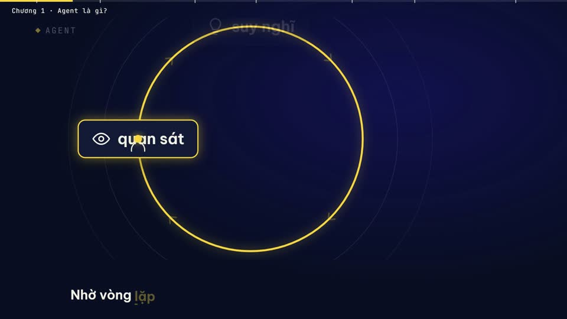
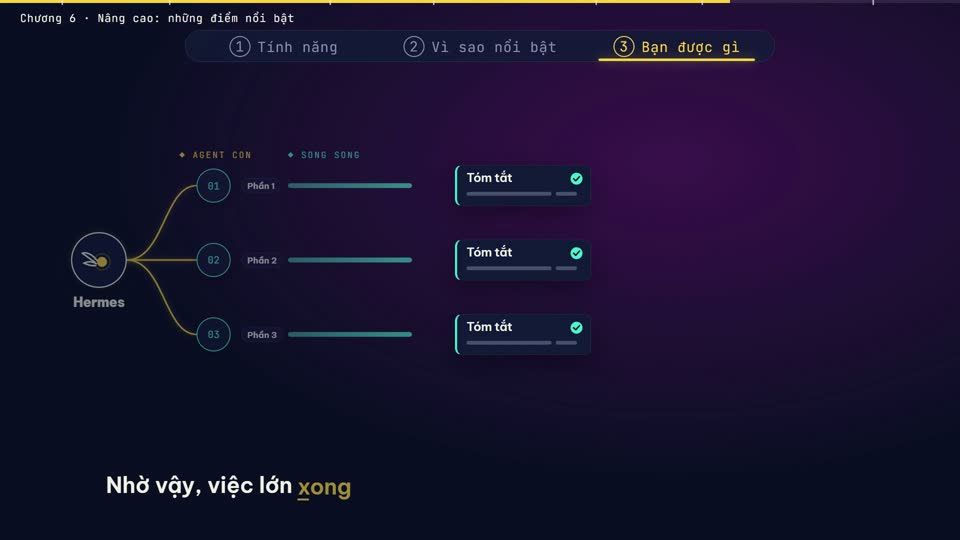
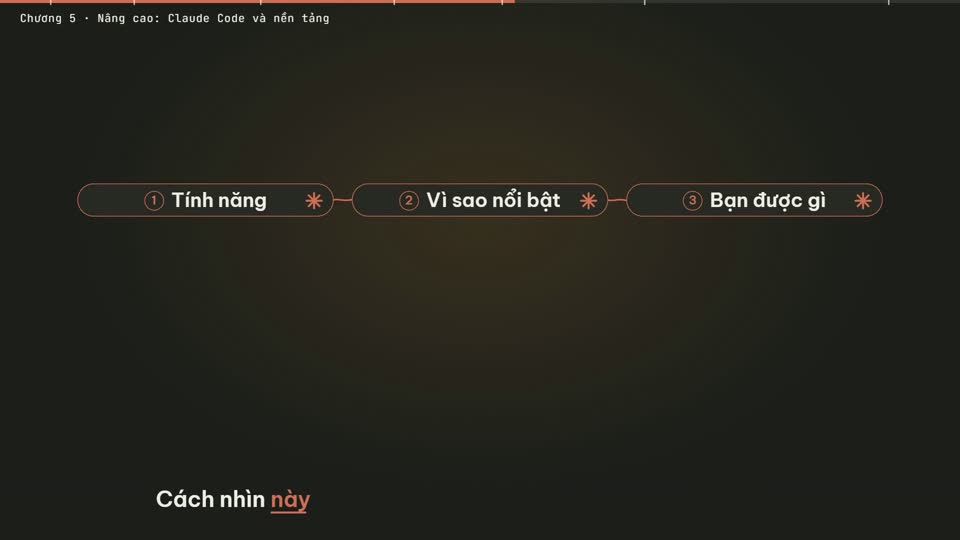
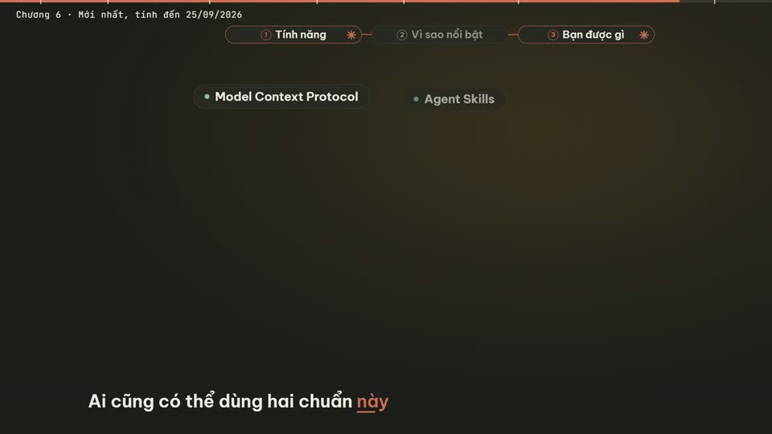
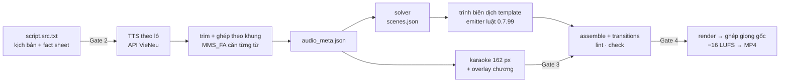

# abm-video-bgdt: video bài giảng điện tử tiếng Việt do agent dựng

**abm-video-bgdt** là một *agent skill*: một bộ hướng dẫn và công cụ giúp một coding agent (Claude Code và các agent đọc được
`SKILL.md`) tự làm một video bài giảng tiếng Việt 16:9, dài 3–15 phút, từ ý tưởng đến file MP4. Video có:
- giọng đọc tự nhiên từ [VieNeu-TTS](https://github.com/pnnbao97/VieNeu-TTS);
- chữ karaoke hiện từng từ khớp giọng ở 15 % dưới cùng;
- hình động thay đổi liên tục, xuất hiện đúng lúc giọng nói nhắc tới.

Hình được dựng bằng [HyperFrames](https://hyperframes.heygen.com) (HTML + GSAP → video).

> English summary at the [end of this page](#in-english).

| | |
|---|---|
|  |  |
|  |  |

*Khung hình từ hai video đã giao: "Hermes Agent – từ cơ bản đến nâng cao" (10:12, 63 khung) và "Claude – từ cơ bản đến chuyên sâu" (14:35, 79 khung).*

## Skill làm được gì

- **Từ chủ đề đến MP4**, qua 8 giai đoạn có kiểm tra tự động: nghiên cứu nguồn, kịch bản, giọng đọc, căn thời gian từng từ,
  storyboard, dựng khung song song, QA, render.
- **Giọng đọc tiếng Việt** qua MCP `vieneu-tts`, mỗi câu một clip, sau đó căn thời gian từng từ bằng MMS_FA
  (tỉ lệ khớp 156/156 câu ở video đầu).
- **Karaoke khớp tiếng:** mỗi câu hiện trọn, từng từ sáng dần theo giọng; độ lệch đo được tối đa 0,022 s.
- **Chống nhàm chán:**
  - danh mục 20 loại cảnh;
  - kho 12 mảnh ghép bố cục để biến tấu, được khuyến khích tự sáng tác bố cục `custom-*`;
  - lint cảnh báo khi hình lặp lại.
- **Chuẩn DNA BGĐT** (Hook → Core → Case → Action), với 6 thẻ sư phạm: Mục tiêu chương, Nguyên lý cốt lõi, Cách sai · Cách đúng,
  Tình huống, Bài tập nhanh 5 phút, Câu hỏi tình huống.
- **4 cổng duyệt của người dùng:** phát âm và nhịp đọc, kịch bản (trước khi tạo giọng), kiểu karaoke, bản nháp (trước bản cuối).
- **Giao hàng đúng chuẩn:** 1920×1080, −16 LUFS, file `chapters.txt` cho YouTube/LMS, bản 720p gửi điện thoại, báo cáo QA.
- **Theme ABM tùy chọn** (Navy #030548, vàng cam #F9B508, Montserrat) và bước dọn file trung gian sau khi giao.

## Cách hoạt động

Skill là một dây chuyền sản xuất, không phải một bản hướng dẫn: CLI `abm-video` giữ trạng thái từng giai đoạn và các cổng
duyệt, còn khung hình được **biên dịch** từ thư viện 20 template cảnh (54 biến thể), không phải do model tự viết HTML.



- **Model chỉ viết:** fact sheet, kịch bản, và (tùy chọn) chỉnh `scenes.json`. Tối đa 15 % khung được tự dựng tay (`custom`).
- **Script làm phần còn lại:** giọng đọc, căn thời gian, chọn template và điền nội dung, karaoke, ghép, render, QA, dọn dẹp.
- **Cổng duyệt gắn với file:** câu trả lời của người dùng được ghi bằng `abm-video gate`; file đổi sau khi duyệt thì cổng
  mất hiệu lực và giai đoạn sau từ chối chạy.

Skill dựa trên workflow `faceless-explainer` của HeyGen HyperFrames và thay hai bước của nó: giọng đọc (VieNeu thay cho
TTS của HeyGen) và phụ đề (karaoke 15 % thay cho phụ đề 180 px). Tất cả thông số riêng của một bài nằm trong
`video.config.json`.

## Yêu cầu

| Thành phần | Phiên bản đã chạy | Ghi chú |
|---|---|---|
| Hệ điều hành | Windows 11 | Script chính là PowerShell 7; các đường dẫn đổi được bằng biến môi trường |
| Node.js | 24.x (≥ 20) | chạy script `.mjs` và `npx hyperframes` |
| PowerShell | 7.6 | `run-pipeline.ps1` |
| ffmpeg / ffprobe | 9.0 | trim, ghép, loudnorm, ảnh xem trước |
| uv + Python | uv 0.12, Python ≥ 3.12 | VieNeu-TTS và MCP server |
| HyperFrames CLI | **0.7.99** (ghim) | gọi qua `npx -y hyperframes@0.7.99` |
| GPU NVIDIA (khuyến nghị) | GTX 1080 | TTS chạy được trên CPU nhưng chậm; lần đầu tải model MMS_FA khoảng 1,2 GB |
| Mạng | – | GSAP tải từ jsDelivr khi render |

## Cài đặt

Chạy **một lệnh**. Trình cài làm lần lượt:
1. cài công cụ nền còn thiếu;
2. cài toàn bộ skill HyperFrames;
3. dò phần cứng và cài VieNeu-TTS đúng cấu hình (GPU NVIDIA, Mac Apple Silicon hoặc CPU);
4. đăng ký MCP cho mọi agent tìm thấy;
5. kiểm tra lại.

Trước khi thay đổi gì, trình cài đều hỏi xác nhận.

```powershell
# Windows
powershell -ExecutionPolicy Bypass -c "& ([scriptblock]::Create((irm https://raw.githubusercontent.com/abm-dungtq/abm-video-bgdt/main/setup/install.ps1)))"
```

```bash
# macOS / Linux
curl -fsSL https://raw.githubusercontent.com/abm-dungtq/abm-video-bgdt/main/setup/install.sh | bash
```

Hoặc để agent tự cài. Nói với agent: *"Đọc https://github.com/abm-dungtq/abm-video-bgdt/blob/main/setup/AGENT-SETUP.md và cài
abm-video-bgdt cho máy này."*

Muốn cài thủ công, cần tùy chọn nâng cao, hoặc cần cấu hình riêng cho Claude Code, Codex CLI, Cursor, Gemini CLI, GitHub
Copilot, OpenCode, Windsurf/Devin trên Windows, macOS, Linux? Xem **[SETUP.md](SETUP.md)**. Kiểm tra máy bất cứ lúc nào bằng
`node setup/doctor.mjs`.

## Dùng skill

Nói với agent, ví dụ:

> Làm video bài giảng 10 phút giới thiệu về *<chủ đề>* cho học viên mới, giọng Thanh Bình, theo chuẩn DNA BGĐT.

Agent chỉ lặp một việc: chạy `abm-video next` rồi làm đúng việc nó in ra.

```
node <thư-mục-skill>/bin/abm-video.mjs next      trước khi có dự án (nó bảo chạy init)
node tools/bin/abm-video.mjs next                trong dự án
```

| # | Giai đoạn (`abm-video run …`) | Kết quả |
|---|---|---|
| 0 | `doctor`, `init` | kiểm máy (`doctor --fix` tự cài skill HeyGen thiếu); tạo dự án, `--theme abm-brand` nếu cần |
| 1 | `probe` | thử giọng; **Gate 1**: phát âm thuật ngữ, nhịp đọc |
| 2 | `script` | fact sheet `[F-NN]`, `script.src.txt`; **Gate 2**: duyệt kịch bản |
| 3 | `tts`, `voice` | TTS theo lô qua API, căn thời gian từng từ, `audio_meta.json` |
| 4 | `storyboard`, `compile` | solver viết `scenes.json`; biên dịch mọi khung từ template, lint + snapshot |
| 5 | `karaoke` | phụ đề karaoke; **Gate 3**: xem thử karaoke |
| 6 | `assemble`, `draft` | ghép, lint/check; bản nháp, đo độ khớp; **Gate 4**: duyệt nháp |
| 7 | `final`, `clean` | render cuối, −16 LUFS; dọn khoảng 400 MB file trung gian vào Thùng rác |

Dự án làm trước bản 0.6.0 chuyển sang CLI bằng `abm-video migrate` (mọi khung giữ nguyên, đánh dấu `custom`). Chi tiết từng
giai đoạn nằm trong [references/pipeline-stages.md](references/pipeline-stages.md); cách chỉnh cảnh trong
[references/scene-spec.md](references/scene-spec.md).

## Thư viện mẫu

[`examples/`](examples/) chứa hai bài đã giao, gồm kịch bản, fact sheet, storyboard, `frame.md` và **142 khung HTML**, mỗi khung
kèm một ảnh xem trước. [`examples/CATALOG.md`](examples/CATALOG.md) xếp mọi khung theo loại cảnh, để agent tìm được ví dụ thật cho
`hub`, `split`, `stat`, `terminal`… trước khi dựng khung tương tự. Ảnh chụp tài khoản thật đã được thay bằng ảnh giữ chỗ.

## Cấu trúc repo

```
SKILL.md                 hướng dẫn cho agent (điểm vào)
SETUP.md                 cài đặt theo agent và hệ điều hành
references/              quy trình từng bước, viết kịch bản, storyboard và bố cục, các lỗi đã gặp
scripts/                 công cụ; mỗi dự án nhận một bản sao trong tools/
templates/               cấu hình mẫu, kịch bản mẫu, bộ hướng dẫn cho worker, theme, font (OFL)
mcp/vieneu-tts/          MCP server giọng đọc và script khởi động API (start-api.mjs)
setup/                   trình cài 1 lệnh, doctor, dò phần cứng, đăng ký MCP, runbook cho agent
examples/                thư viện mẫu từ hai video đã giao
dev/                     kiểm tra hồi quy, test lint, dựng thư viện mẫu
```

## Phát triển skill

```bash
node dev/run-lint-tests.mjs                                   # lint-tests ok (2/2)
node dev/regression-check.mjs --baseline v0.4.0 <dự-án>…      # đầu ra phải giống từng byte bản mốc
node dev/build-examples.mjs <dự-án>…                          # dựng lại examples/
```

Mỗi thay đổi ở `scripts/` phải qua `regression-check` trên các dự án đã giao. Muốn nâng bản HyperFrames đang ghim, trước hết
cho `fixture-check.mjs` chạy đạt trên bản mới, rồi viết `templates/worker-kit/worker-delta-<pin>.md.tmpl` cho bản đó.

## Giới hạn đã biết

- Mới được kiểm chứng đầy đủ trên Windows 11 với Claude Code. Agent và hệ điều hành khác làm theo SETUP.md; báo lỗi qua Issues.
- Chỉ hỗ trợ tiếng Việt: căn thời gian và đếm âm tiết đều theo tiếng Việt.
- CLI ghim ở HyperFrames 0.7.99. Tài liệu HyperFrames mới hơn (0.8.x) có nhiều chỗ khác; xem `templates/worker-kit/worker-delta-0.7.99.md.tmpl`.
- Render một video 10–15 phút mất 17–25 phút, và cần mạng để tải GSAP.

## Giấy phép và ghi công

- Mã và thư viện mẫu: [MIT](LICENSE). Font: SIL Open Font License 1.1 (`templates/fonts/OFL-*.txt`).
- Dựa trên [HyperFrames](https://hyperframes.heygen.com) của HeyGen và [VieNeu-TTS](https://github.com/pnnbao97/VieNeu-TTS) của pnnbao97.
- Tác giả: ABM (abm-dungtq), soạn cùng Claude Code.

## In English

**abm-video-bgdt** is an agent skill that lets a coding agent (Claude Code, or any agent that reads `SKILL.md`) produce a
3–15-minute Vietnamese e-learning lesson video, 1920×1080:
- narration from VieNeu-TTS through an MCP server included here;
- word-by-word karaoke captions aligned with MMS_FA;
- motion-graphics frames built in HyperFrames by parallel worker agents.

It adds four human review gates, the DNA BGĐT lesson structure, a layout library meant for remixing, anti-boredom lint, an
optional ABM brand theme, regression tests, and an example library of 142 real frames with previews. Setup for Claude Code, Codex CLI, Cursor, Gemini CLI, GitHub Copilot, OpenCode and Windsurf/Devin on Windows, macOS and
Linux is in [SETUP.md](SETUP.md) (in Vietnamese; commands and config snippets are universal). No machine-specific paths:
scripts discover the HeyGen skills and a `VieNeu-TTS/` folder, or read `VIENEU_TTS_DIR` / `HF_SKILLS_DIR`.

Tested on Windows 11. MIT licensed.
