# Frame catalog

Every frame of the example videos, generated by `dev/build-examples.mjs`. Use it to find a worked example of a shot type
(for instance a `hub` or a `split`) before building a similar frame. The previews are taken at 75 % of each frame from the
final video; frames that showed a private account screenshot have no preview.

## By shot type

- **anchor** (16): [hermes 4](hermes-agent-explainer/compositions/frames/04-sau-bai-hoc-nay.html), [hermes 11](hermes-agent-explainer/compositions/frames/11-tom-tat-chuong-mot.html), [hermes 21](hermes-agent-explainer/compositions/frames/21-tom-tat-chuong-hai.html), [hermes 28](hermes-agent-explainer/compositions/frames/28-tom-tat-chuong-ba.html), [hermes 39](hermes-agent-explainer/compositions/frames/39-tom-tat-chuong-bon.html), [hermes 46](hermes-agent-explainer/compositions/frames/46-tom-tat-chuong-nam.html), [hermes 57](hermes-agent-explainer/compositions/frames/57-tom-tat-chuong-sau.html), [hermes 62](hermes-agent-explainer/compositions/frames/62-tong-ket-bai-hoc.html), [claude 4](claude-intro-explainer/compositions/frames/04-sau-bai-hoc-nay.html), [claude 11](claude-intro-explainer/compositions/frames/11-tom-tat-chuong-mot.html), [claude 21](claude-intro-explainer/compositions/frames/21-tom-tat-chuong-hai.html), [claude 32](claude-intro-explainer/compositions/frames/32-tom-tat-chuong-ba.html), [claude 42](claude-intro-explainer/compositions/frames/42-tom-tat-chuong-bon.html), [claude 54](claude-intro-explainer/compositions/frames/54-tom-tat-chuong-nam.html), [claude 73](claude-intro-explainer/compositions/frames/73-tom-tat-chuong-sau.html), [claude 79](claude-intro-explainer/compositions/frames/79-buoc-tiep-theo.html)
- **cards** (29): [hermes 3](hermes-agent-explainer/compositions/frames/03-mien-phi-va-chay-o-dau-cung-duoc.html), [hermes 6](hermes-agent-explainer/compositions/frames/06-chatbot-chi-tra-loi.html), [hermes 15](hermes-agent-explainer/compositions/frames/15-trinh-cai-dat-lo-het.html), [hermes 23](hermes-agent-explainer/compositions/frames/23-nhung-cong-cu-quen-thuoc.html), [hermes 24](hermes-agent-explainer/compositions/frames/24-bo-cong-cu-la-gi.html), [hermes 36](hermes-agent-explainer/compositions/frames/36-day-hermes-bang-lenh-learn.html), [hermes 44](hermes-agent-explainer/compositions/frames/44-viec-tu-dong-theo-lich.html), [hermes 49](hermes-agent-explainer/compositions/frames/49-agent-con-lam-viec-song-song.html), [hermes 52](hermes-agent-explainer/compositions/frames/52-bay-moi-truong-chay-lenh.html), [hermes 55](hermes-agent-explainer/compositions/frames/55-tep-ngu-canh-cho-du-an.html), [hermes 60](hermes-agent-explainer/compositions/frames/60-bao-ve-bi-mat-cua-ban.html), [hermes 62](hermes-agent-explainer/compositions/frames/62-tong-ket-bai-hoc.html), [claude 2](claude-intro-explainer/compositions/frames/02-mot-dong-nghiep-luon-san-sang.html), [claude 3](claude-intro-explainer/compositions/frames/03-claude-o-khap-noi.html), [claude 7](claude-intro-explainer/compositions/frames/07-ho-nha-claude.html), [claude 10](claude-intro-explainer/compositions/frames/10-dong-bo-tren-moi-thiet-bi.html), [claude 14](claude-intro-explainer/compositions/frames/14-cau-hoi-dau-tien.html), [claude 16](claude-intro-explainer/compositions/frames/16-file-nao-cung-doc-duoc.html), [claude 25](claude-intro-explainer/compositions/frames/25-khong-co-va-co-project.html), [claude 28](claude-intro-explainer/compositions/frames/28-docs-slides-va-design.html), [claude 36](claude-intro-explainer/compositions/frames/36-khong-chi-doc-ma-con-lam.html), [claude 45](claude-intro-explainer/compositions/frames/45-claude-code-trong-terminal.html), [claude 47](claude-intro-explainer/compositions/frames/47-skill-cong-thuc-lam-viec.html), [claude 62](claude-intro-explainer/compositions/frames/62-claude-docs-slides-va-design.html), [claude 67](claude-intro-explainer/compositions/frames/67-connector-co-giao-dien-rieng.html), [claude 68](claude-intro-explainer/compositions/frames/68-claude-tag-trong-slack.html), [claude 72](claude-intro-explainer/compositions/frames/72-muoi-tinh-nang-trong-mot-khung.html), [claude 76](claude-intro-explainer/compositions/frames/76-ba-thoi-quen-an-toan.html), [claude 78](claude-intro-explainer/compositions/frames/78-hanh-trinh-cua-ban-hom-nay.html)
- **flow** (27): [hermes 8](hermes-agent-explainer/compositions/frames/08-vong-lap-cua-mot-agent.html), [hermes 9](hermes-agent-explainer/compositions/frames/09-mot-vi-du-doi-thuong.html), [hermes 25](hermes-agent-explainer/compositions/frames/25-hop-do-nghe-cho-lap-trinh.html), [hermes 30](hermes-agent-explainer/compositions/frames/30-vong-hoc-la-gi.html), [hermes 34](hermes-agent-explainer/compositions/frames/34-tu-tao-va-tu-cai-thien.html), [hermes 35](hermes-agent-explainer/compositions/frames/35-kho-ky-nang-cong-dong.html), [hermes 42](hermes-agent-explainer/compositions/frames/42-hon-hai-muoi-nen-tang.html), [hermes 45](hermes-agent-explainer/compositions/frames/45-vi-du-lich-tu-dong.html), [hermes 49](hermes-agent-explainer/compositions/frames/49-agent-con-lam-viec-song-song.html), [hermes 59](hermes-agent-explainer/compositions/frames/59-hoi-truoc-khi-lam-viec-nguy-hiem.html), [claude 6](claude-intro-explainer/compositions/frames/06-tim-kiem-va-tro-chuyen.html), [claude 9](claude-intro-explainer/compositions/frames/09-nhieu-cach-de-lam-viec-voi-claude.html), [claude 10](claude-intro-explainer/compositions/frames/10-dong-bo-tren-moi-thiet-bi.html), [claude 15](claude-intro-explainer/compositions/frames/15-tai-file-len.html), [claude 18](claude-intro-explainer/compositions/frames/18-cach-hoi-de-duoc-tra-loi-hay.html), [claude 20](claude-intro-explainer/compositions/frames/20-sua-va-hoi-tiep.html), [claude 36](claude-intro-explainer/compositions/frames/36-khong-chi-doc-ma-con-lam.html), [claude 41](claude-intro-explainer/compositions/frames/41-can-than-lenh-an.html), [claude 44](claude-intro-explainer/compositions/frames/44-ba-cau-hoi-cho-moi-diem-noi-bat.html), [claude 49](claude-intro-explainer/compositions/frames/49-hook-viec-luon-xay-ra.html), [claude 56](claude-intro-explainer/compositions/frames/56-mot-nam-thay-doi-rat-nhanh.html), [claude 61](claude-intro-explainer/compositions/frames/61-cowork-va-chat-gop-lam-mot.html), [claude 62](claude-intro-explainer/compositions/frames/62-claude-docs-slides-va-design.html), [claude 64](claude-intro-explainer/compositions/frames/64-projects-duoc-thiet-ke-lai.html), [claude 69](claude-intro-explainer/compositions/frames/69-claude-marketplace.html), [claude 71](claude-intro-explainer/compositions/frames/71-skill-theo-ban-xuong-terminal.html), [claude 75](claude-intro-explainer/compositions/frames/75-lop-bao-ve-cua-anthropic.html)
- **hub** (20): [hermes 3](hermes-agent-explainer/compositions/frames/03-mien-phi-va-chay-o-dau-cung-duoc.html), [hermes 16](hermes-agent-explainer/compositions/frames/16-chon-bo-nao-cho-hermes.html), [hermes 25](hermes-agent-explainer/compositions/frames/25-hop-do-nghe-cho-lap-trinh.html), [hermes 35](hermes-agent-explainer/compositions/frames/35-kho-ky-nang-cong-dong.html), [hermes 38](hermes-agent-explainer/compositions/frames/38-hieu-ban-sau-hon-voi-honcho.html), [hermes 41](hermes-agent-explainer/compositions/frames/41-tro-chuyen-tu-ung-dung-quen-thuoc.html), [hermes 51](hermes-agent-explainer/compositions/frames/51-mcp-cong-cam-chung.html), [hermes 60](hermes-agent-explainer/compositions/frames/60-bao-ve-bi-mat-cua-ban.html), [claude 3](claude-intro-explainer/compositions/frames/03-claude-o-khap-noi.html), [claude 9](claude-intro-explainer/compositions/frames/09-nhieu-cach-de-lam-viec-voi-claude.html), [claude 24](claude-intro-explainer/compositions/frames/24-ben-trong-mot-project.html), [claude 26](claude-intro-explainer/compositions/frames/26-artifact-la-gi.html), [claude 32](claude-intro-explainer/compositions/frames/32-tom-tat-chuong-ba.html), [claude 34](claude-intro-explainer/compositions/frames/34-connectors-canh-tay-noi-dai.html), [claude 38](claude-intro-explainer/compositions/frames/38-bat-research.html), [claude 48](claude-intro-explainer/compositions/frames/48-subagent-tro-ly-phu.html), [claude 50](claude-intro-explainer/compositions/frames/50-mcp-cong-ket-noi-chung.html), [claude 63](claude-intro-explainer/compositions/frames/63-slides-ngay-trong-cuoc-tro-chuyen.html), [claude 68](claude-intro-explainer/compositions/frames/68-claude-tag-trong-slack.html), [claude 71](claude-intro-explainer/compositions/frames/71-skill-theo-ban-xuong-terminal.html)
- **journey** (14): [hermes 4](hermes-agent-explainer/compositions/frames/04-sau-bai-hoc-nay.html), [hermes 9](hermes-agent-explainer/compositions/frames/09-mot-vi-du-doi-thuong.html), [hermes 14](hermes-agent-explainer/compositions/frames/14-cach-nhanh-nhat-cho-nguoi-moi.html), [hermes 34](hermes-agent-explainer/compositions/frames/34-tu-tao-va-tu-cai-thien.html), [hermes 56](hermes-agent-explainer/compositions/frames/56-vi-sao-nhung-dieu-nay-quan-trong.html), [hermes 61](hermes-agent-explainer/compositions/frames/61-luon-co-duong-lui.html), [claude 4](claude-intro-explainer/compositions/frames/04-sau-bai-hoc-nay.html), [claude 7](claude-intro-explainer/compositions/frames/07-ho-nha-claude.html), [claude 20](claude-intro-explainer/compositions/frames/20-sua-va-hoi-tiep.html), [claude 51](claude-intro-explainer/compositions/frames/51-plugin-dong-goi-tat-ca.html), [claude 53](claude-intro-explainer/compositions/frames/53-nen-tang-cho-nha-phat-trien.html), [claude 56](claude-intro-explainer/compositions/frames/56-mot-nam-thay-doi-rat-nhanh.html), [claude 66](claude-intro-explainer/compositions/frames/66-cowork-trong-chrome.html), [claude 78](claude-intro-explainer/compositions/frames/78-hanh-trinh-cua-ban-hom-nay.html)
- **kinetic** (48): [hermes 2](hermes-agent-explainer/compositions/frames/02-mot-tro-ly-biet-tu-hoc.html), [hermes 8](hermes-agent-explainer/compositions/frames/08-vong-lap-cua-mot-agent.html), [hermes 10](hermes-agent-explainer/compositions/frames/10-hermes-khong-chi-la-chatbot.html), [hermes 13](hermes-agent-explainer/compositions/frames/13-mot-dong-lenh-la-xong.html), [hermes 15](hermes-agent-explainer/compositions/frames/15-trinh-cai-dat-lo-het.html), [hermes 17](hermes-agent-explainer/compositions/frames/17-luu-y-ve-bo-nho-ngu-canh.html), [hermes 24](hermes-agent-explainer/compositions/frames/24-bo-cong-cu-la-gi.html), [hermes 27](hermes-agent-explainer/compositions/frames/27-vi-sao-nen-chon-loc.html), [hermes 30](hermes-agent-explainer/compositions/frames/30-vong-hoc-la-gi.html), [hermes 32](hermes-agent-explainer/compositions/frames/32-tim-lai-cuoc-tro-chuyen-cu.html), [hermes 41](hermes-agent-explainer/compositions/frames/41-tro-chuyen-tu-ung-dung-quen-thuoc.html), [hermes 48](hermes-agent-explainer/compositions/frames/48-chi-can-nam-y-chinh.html), [hermes 54](hermes-agent-explainer/compositions/frames/54-soul-md-linh-hon-cua-agent.html), [hermes 56](hermes-agent-explainer/compositions/frames/56-vi-sao-nhung-dieu-nay-quan-trong.html), [hermes 59](hermes-agent-explainer/compositions/frames/59-hoi-truoc-khi-lam-viec-nguy-hiem.html), [hermes 63](hermes-agent-explainer/compositions/frames/63-buoc-tiep-theo.html), [claude 2](claude-intro-explainer/compositions/frames/02-mot-dong-nghiep-luon-san-sang.html), [claude 4](claude-intro-explainer/compositions/frames/04-sau-bai-hoc-nay.html), [claude 7](claude-intro-explainer/compositions/frames/07-ho-nha-claude.html), [claude 9](claude-intro-explainer/compositions/frames/09-nhieu-cach-de-lam-viec-voi-claude.html), [claude 11](claude-intro-explainer/compositions/frames/11-tom-tat-chuong-mot.html), [claude 13](claude-intro-explainer/compositions/frames/13-man-hinh-dau-tien.html), [claude 14](claude-intro-explainer/compositions/frames/14-cau-hoi-dau-tien.html), [claude 16](claude-intro-explainer/compositions/frames/16-file-nao-cung-doc-duoc.html), [claude 21](claude-intro-explainer/compositions/frames/21-tom-tat-chuong-hai.html), [claude 26](claude-intro-explainer/compositions/frames/26-artifact-la-gi.html), [claude 28](claude-intro-explainer/compositions/frames/28-docs-slides-va-design.html), [claude 30](claude-intro-explainer/compositions/frames/30-nho-co-chon-loc.html), [claude 31](claude-intro-explainer/compositions/frames/31-tro-chuyen-an-danh.html), [claude 34](claude-intro-explainer/compositions/frames/34-connectors-canh-tay-noi-dai.html), [claude 35](claude-intro-explainer/compositions/frames/35-bat-mot-connector.html), [claude 37](claude-intro-explainer/compositions/frames/37-research-nghien-cuu-sau.html), [claude 39](claude-intro-explainer/compositions/frames/39-claude-trong-trinh-duyet.html), [claude 41](claude-intro-explainer/compositions/frames/41-can-than-lenh-an.html), [claude 44](claude-intro-explainer/compositions/frames/44-ba-cau-hoi-cho-moi-diem-noi-bat.html), [claude 45](claude-intro-explainer/compositions/frames/45-claude-code-trong-terminal.html), [claude 49](claude-intro-explainer/compositions/frames/49-hook-viec-luon-xay-ra.html), [claude 51](claude-intro-explainer/compositions/frames/51-plugin-dong-goi-tat-ca.html), [claude 54](claude-intro-explainer/compositions/frames/54-tom-tat-chuong-nam.html), [claude 56](claude-intro-explainer/compositions/frames/56-mot-nam-thay-doi-rat-nhanh.html), [claude 58](claude-intro-explainer/compositions/frames/58-cung-mot-model-khac-lop-an-toan.html), [claude 60](claude-intro-explainer/compositions/frames/60-trung-thuc-nhat-tu-truoc-toi-nay.html), [claude 62](claude-intro-explainer/compositions/frames/62-claude-docs-slides-va-design.html), [claude 69](claude-intro-explainer/compositions/frames/69-claude-marketplace.html), [claude 70](claude-intro-explainer/compositions/frames/70-hai-chuan-mo-phia-sau.html), [claude 75](claude-intro-explainer/compositions/frames/75-lop-bao-ve-cua-anthropic.html), [claude 77](claude-intro-explainer/compositions/frames/77-chat-an-danh-khac-gi.html), [claude 79](claude-intro-explainer/compositions/frames/79-buoc-tiep-theo.html)
- **metaphor** (25): [hermes 2](hermes-agent-explainer/compositions/frames/02-mot-tro-ly-biet-tu-hoc.html), [hermes 7](hermes-agent-explainer/compositions/frames/07-agent-thi-bat-tay-vao-lam.html), [hermes 16](hermes-agent-explainer/compositions/frames/16-chon-bo-nao-cho-hermes.html), [hermes 23](hermes-agent-explainer/compositions/frames/23-nhung-cong-cu-quen-thuoc.html), [hermes 24](hermes-agent-explainer/compositions/frames/24-bo-cong-cu-la-gi.html), [hermes 31](hermes-agent-explainer/compositions/frames/31-hai-cuon-so-ghi-nho.html), [hermes 33](hermes-agent-explainer/compositions/frames/33-ky-nang-la-tri-nho-ve-cach-lam.html), [hermes 37](hermes-agent-explainer/compositions/frames/37-nguoi-don-dep-ky-nang.html), [hermes 44](hermes-agent-explainer/compositions/frames/44-viec-tu-dong-theo-lich.html), [hermes 51](hermes-agent-explainer/compositions/frames/51-mcp-cong-cam-chung.html), [hermes 54](hermes-agent-explainer/compositions/frames/54-soul-md-linh-hon-cua-agent.html), [hermes 59](hermes-agent-explainer/compositions/frames/59-hoi-truoc-khi-lam-viec-nguy-hiem.html), [claude 2](claude-intro-explainer/compositions/frames/02-mot-dong-nghiep-luon-san-sang.html), [claude 6](claude-intro-explainer/compositions/frames/06-tim-kiem-va-tro-chuyen.html), [claude 8](claude-intro-explainer/compositions/frames/08-chon-model-nhu-chon-nguoi-giup-viec.html), [claude 19](claude-intro-explainer/compositions/frames/19-hoi-chung-chung-va-hoi-cu-the.html), [claude 23](claude-intro-explainer/compositions/frames/23-moi-du-an-mot-ngan-keo.html), [claude 29](claude-intro-explainer/compositions/frames/29-claude-biet-ghi-nho.html), [claude 39](claude-intro-explainer/compositions/frames/39-claude-trong-trinh-duyet.html), [claude 46](claude-intro-explainer/compositions/frames/46-claude-md-bang-noi-quy.html), [claude 51](claude-intro-explainer/compositions/frames/51-plugin-dong-goi-tat-ca.html), [claude 58](claude-intro-explainer/compositions/frames/58-cung-mot-model-khac-lop-an-toan.html), [claude 65](claude-intro-explainer/compositions/frames/65-mot-bo-nho-chung-cho-ca-du-an.html), [claude 77](claude-intro-explainer/compositions/frames/77-chat-an-danh-khac-gi.html), [claude 78](claude-intro-explainer/compositions/frames/78-hanh-trinh-cua-ban-hom-nay.html)
- **screen** (10): [claude 13](claude-intro-explainer/compositions/frames/13-man-hinh-dau-tien.html), [claude 15](claude-intro-explainer/compositions/frames/15-tai-file-len.html), [claude 24](claude-intro-explainer/compositions/frames/24-ben-trong-mot-project.html), [claude 27](claude-intro-explainer/compositions/frames/27-artifact-ngay-ben-canh-cuoc-tro-chuyen.html), [claude 31](claude-intro-explainer/compositions/frames/31-tro-chuyen-an-danh.html), [claude 35](claude-intro-explainer/compositions/frames/35-bat-mot-connector.html), [claude 38](claude-intro-explainer/compositions/frames/38-bat-research.html), [claude 61](claude-intro-explainer/compositions/frames/61-cowork-va-chat-gop-lam-mot.html), [claude 63](claude-intro-explainer/compositions/frames/63-slides-ngay-trong-cuoc-tro-chuyen.html), [claude 66](claude-intro-explainer/compositions/frames/66-cowork-trong-chrome.html)
- **split** (26): [hermes 6](hermes-agent-explainer/compositions/frames/06-chatbot-chi-tra-loi.html), [hermes 7](hermes-agent-explainer/compositions/frames/07-agent-thi-bat-tay-vao-lam.html), [hermes 18](hermes-agent-explainer/compositions/frames/18-hai-giao-dien-dong-lenh.html), [hermes 20](hermes-agent-explainer/compositions/frames/20-khoa-bi-mat-va-cai-dat.html), [hermes 25](hermes-agent-explainer/compositions/frames/25-hop-do-nghe-cho-lap-trinh.html), [hermes 26](hermes-agent-explainer/compositions/frames/26-bat-tat-cong-cu.html), [hermes 43](hermes-agent-explainer/compositions/frames/43-thiet-lap-gateway.html), [hermes 50](hermes-agent-explainer/compositions/frames/50-viet-code-de-goi-cong-cu.html), [claude 6](claude-intro-explainer/compositions/frames/06-tim-kiem-va-tro-chuyen.html), [claude 8](claude-intro-explainer/compositions/frames/08-chon-model-nhu-chon-nguoi-giup-viec.html), [claude 16](claude-intro-explainer/compositions/frames/16-file-nao-cung-doc-duoc.html), [claude 19](claude-intro-explainer/compositions/frames/19-hoi-chung-chung-va-hoi-cu-the.html), [claude 24](claude-intro-explainer/compositions/frames/24-ben-trong-mot-project.html), [claude 25](claude-intro-explainer/compositions/frames/25-khong-co-va-co-project.html), [claude 30](claude-intro-explainer/compositions/frames/30-nho-co-chon-loc.html), [claude 34](claude-intro-explainer/compositions/frames/34-connectors-canh-tay-noi-dai.html), [claude 40](claude-intro-explainer/compositions/frames/40-trinh-duyet-hay-ung-dung-may-tinh.html), [claude 46](claude-intro-explainer/compositions/frames/46-claude-md-bang-noi-quy.html), [claude 50](claude-intro-explainer/compositions/frames/50-mcp-cong-ket-noi-chung.html), [claude 52](claude-intro-explainer/compositions/frames/52-claude-code-tren-ung-dung-may-tinh.html), [claude 57](claude-intro-explainer/compositions/frames/57-fable-5-va-mythos-5.html), [claude 59](claude-intro-explainer/compositions/frames/59-claude-opus-5-5.html), [claude 61](claude-intro-explainer/compositions/frames/61-cowork-va-chat-gop-lam-mot.html), [claude 65](claude-intro-explainer/compositions/frames/65-mot-bo-nho-chung-cho-ca-du-an.html), [claude 70](claude-intro-explainer/compositions/frames/70-hai-chuan-mo-phia-sau.html), [claude 77](claude-intro-explainer/compositions/frames/77-chat-an-danh-khac-gi.html)
- **stat** (21): [hermes 3](hermes-agent-explainer/compositions/frames/03-mien-phi-va-chay-o-dau-cung-duoc.html), [hermes 7](hermes-agent-explainer/compositions/frames/07-agent-thi-bat-tay-vao-lam.html), [hermes 14](hermes-agent-explainer/compositions/frames/14-cach-nhanh-nhat-cho-nguoi-moi.html), [hermes 17](hermes-agent-explainer/compositions/frames/17-luu-y-ve-bo-nho-ngu-canh.html), [hermes 19](hermes-agent-explainer/compositions/frames/19-thanh-trang-thai.html), [hermes 27](hermes-agent-explainer/compositions/frames/27-vi-sao-nen-chon-loc.html), [hermes 31](hermes-agent-explainer/compositions/frames/31-hai-cuon-so-ghi-nho.html), [hermes 37](hermes-agent-explainer/compositions/frames/37-nguoi-don-dep-ky-nang.html), [hermes 42](hermes-agent-explainer/compositions/frames/42-hon-hai-muoi-nen-tang.html), [hermes 50](hermes-agent-explainer/compositions/frames/50-viet-code-de-goi-cong-cu.html), [hermes 52](hermes-agent-explainer/compositions/frames/52-bay-moi-truong-chay-lenh.html), [hermes 53](hermes-agent-explainer/compositions/frames/53-ngu-dong-khi-ranh.html), [hermes 59](hermes-agent-explainer/compositions/frames/59-hoi-truoc-khi-lam-viec-nguy-hiem.html), [claude 17](claude-intro-explainer/compositions/frames/17-nhung-con-so-can-biet.html), [claude 27](claude-intro-explainer/compositions/frames/27-artifact-ngay-ben-canh-cuoc-tro-chuyen.html), [claude 37](claude-intro-explainer/compositions/frames/37-research-nghien-cuu-sau.html), [claude 57](claude-intro-explainer/compositions/frames/57-fable-5-va-mythos-5.html), [claude 59](claude-intro-explainer/compositions/frames/59-claude-opus-5-5.html), [claude 69](claude-intro-explainer/compositions/frames/69-claude-marketplace.html), [claude 72](claude-intro-explainer/compositions/frames/72-muoi-tinh-nang-trong-mot-khung.html), [claude 77](claude-intro-explainer/compositions/frames/77-chat-an-danh-khac-gi.html)
- **terminal** (10): [hermes 13](hermes-agent-explainer/compositions/frames/13-mot-dong-lenh-la-xong.html), [hermes 16](hermes-agent-explainer/compositions/frames/16-chon-bo-nao-cho-hermes.html), [hermes 18](hermes-agent-explainer/compositions/frames/18-hai-giao-dien-dong-lenh.html), [hermes 26](hermes-agent-explainer/compositions/frames/26-bat-tat-cong-cu.html), [hermes 32](hermes-agent-explainer/compositions/frames/32-tim-lai-cuoc-tro-chuyen-cu.html), [hermes 38](hermes-agent-explainer/compositions/frames/38-hieu-ban-sau-hon-voi-honcho.html), [hermes 43](hermes-agent-explainer/compositions/frames/43-thiet-lap-gateway.html), [hermes 51](hermes-agent-explainer/compositions/frames/51-mcp-cong-cam-chung.html), [claude 45](claude-intro-explainer/compositions/frames/45-claude-code-trong-terminal.html), [claude 71](claude-intro-explainer/compositions/frames/71-skill-theo-ban-xuong-terminal.html)
- **title** (16): [hermes 1](hermes-agent-explainer/compositions/frames/01-hermes-agent-tu-co-ban-den-nang-cao.html), [hermes 5](hermes-agent-explainer/compositions/frames/05-agent-la-gi.html), [hermes 12](hermes-agent-explainer/compositions/frames/12-cai-dat-va-tro-chuyen-dau-tien.html), [hermes 22](hermes-agent-explainer/compositions/frames/22-cong-cu-va-bo-cong-cu.html), [hermes 29](hermes-agent-explainer/compositions/frames/29-vong-hoc-khep-kin.html), [hermes 40](hermes-agent-explainer/compositions/frames/40-luon-ben-ban.html), [hermes 47](hermes-agent-explainer/compositions/frames/47-nang-cao-nhung-diem-noi-bat.html), [hermes 58](hermes-agent-explainer/compositions/frames/58-dung-an-toan-va-tong-ket.html), [claude 1](claude-intro-explainer/compositions/frames/01-claude-tu-co-ban-den-chuyen-sau.html), [claude 5](claude-intro-explainer/compositions/frames/05-lam-quen-voi-claude.html), [claude 12](claude-intro-explainer/compositions/frames/12-co-ban-tren-claude-ai.html), [claude 22](claude-intro-explainer/compositions/frames/22-lam-viec-co-to-chuc.html), [claude 33](claude-intro-explainer/compositions/frames/33-ket-noi-va-nghien-cuu.html), [claude 43](claude-intro-explainer/compositions/frames/43-nang-cao-claude-code-va-nen-tang.html), [claude 55](claude-intro-explainer/compositions/frames/55-moi-nhat-tinh-den-25-09-2026.html), [claude 74](claude-intro-explainer/compositions/frames/74-dung-an-toan-va-tong-ket.html)
- **typewriter** (20): [hermes 2](hermes-agent-explainer/compositions/frames/02-mot-tro-ly-biet-tu-hoc.html), [hermes 9](hermes-agent-explainer/compositions/frames/09-mot-vi-du-doi-thuong.html), [hermes 14](hermes-agent-explainer/compositions/frames/14-cach-nhanh-nhat-cho-nguoi-moi.html), [hermes 18](hermes-agent-explainer/compositions/frames/18-hai-giao-dien-dong-lenh.html), [hermes 33](hermes-agent-explainer/compositions/frames/33-ky-nang-la-tri-nho-ve-cach-lam.html), [hermes 36](hermes-agent-explainer/compositions/frames/36-day-hermes-bang-lenh-learn.html), [hermes 44](hermes-agent-explainer/compositions/frames/44-viec-tu-dong-theo-lich.html), [hermes 45](hermes-agent-explainer/compositions/frames/45-vi-du-lich-tu-dong.html), [hermes 54](hermes-agent-explainer/compositions/frames/54-soul-md-linh-hon-cua-agent.html), [hermes 63](hermes-agent-explainer/compositions/frames/63-buoc-tiep-theo.html), [claude 2](claude-intro-explainer/compositions/frames/02-mot-dong-nghiep-luon-san-sang.html), [claude 8](claude-intro-explainer/compositions/frames/08-chon-model-nhu-chon-nguoi-giup-viec.html), [claude 14](claude-intro-explainer/compositions/frames/14-cau-hoi-dau-tien.html), [claude 18](claude-intro-explainer/compositions/frames/18-cach-hoi-de-duoc-tra-loi-hay.html), [claude 29](claude-intro-explainer/compositions/frames/29-claude-biet-ghi-nho.html), [claude 41](claude-intro-explainer/compositions/frames/41-can-than-lenh-an.html), [claude 47](claude-intro-explainer/compositions/frames/47-skill-cong-thuc-lam-viec.html), [claude 59](claude-intro-explainer/compositions/frames/59-claude-opus-5-5.html), [claude 64](claude-intro-explainer/compositions/frames/64-projects-duoc-thiet-ke-lai.html), [claude 67](claude-intro-explainer/compositions/frames/67-connector-co-giao-dien-rieng.html)
- **zoom** (29): [hermes 8](hermes-agent-explainer/compositions/frames/08-vong-lap-cua-mot-agent.html), [hermes 10](hermes-agent-explainer/compositions/frames/10-hermes-khong-chi-la-chatbot.html), [hermes 13](hermes-agent-explainer/compositions/frames/13-mot-dong-lenh-la-xong.html), [hermes 19](hermes-agent-explainer/compositions/frames/19-thanh-trang-thai.html), [hermes 31](hermes-agent-explainer/compositions/frames/31-hai-cuon-so-ghi-nho.html), [hermes 32](hermes-agent-explainer/compositions/frames/32-tim-lai-cuoc-tro-chuyen-cu.html), [hermes 45](hermes-agent-explainer/compositions/frames/45-vi-du-lich-tu-dong.html), [hermes 53](hermes-agent-explainer/compositions/frames/53-ngu-dong-khi-ranh.html), [hermes 55](hermes-agent-explainer/compositions/frames/55-tep-ngu-canh-cho-du-an.html), [hermes 60](hermes-agent-explainer/compositions/frames/60-bao-ve-bi-mat-cua-ban.html), [hermes 61](hermes-agent-explainer/compositions/frames/61-luon-co-duong-lui.html), [claude 3](claude-intro-explainer/compositions/frames/03-claude-o-khap-noi.html), [claude 10](claude-intro-explainer/compositions/frames/10-dong-bo-tren-moi-thiet-bi.html), [claude 17](claude-intro-explainer/compositions/frames/17-nhung-con-so-can-biet.html), [claude 23](claude-intro-explainer/compositions/frames/23-moi-du-an-mot-ngan-keo.html), [claude 28](claude-intro-explainer/compositions/frames/28-docs-slides-va-design.html), [claude 30](claude-intro-explainer/compositions/frames/30-nho-co-chon-loc.html), [claude 37](claude-intro-explainer/compositions/frames/37-research-nghien-cuu-sau.html), [claude 40](claude-intro-explainer/compositions/frames/40-trinh-duyet-hay-ung-dung-may-tinh.html), [claude 48](claude-intro-explainer/compositions/frames/48-subagent-tro-ly-phu.html), [claude 50](claude-intro-explainer/compositions/frames/50-mcp-cong-ket-noi-chung.html), [claude 52](claude-intro-explainer/compositions/frames/52-claude-code-tren-ung-dung-may-tinh.html), [claude 53](claude-intro-explainer/compositions/frames/53-nen-tang-cho-nha-phat-trien.html), [claude 60](claude-intro-explainer/compositions/frames/60-trung-thuc-nhat-tu-truoc-toi-nay.html), [claude 64](claude-intro-explainer/compositions/frames/64-projects-duoc-thiet-ke-lai.html), [claude 67](claude-intro-explainer/compositions/frames/67-connector-co-giao-dien-rieng.html), [claude 70](claude-intro-explainer/compositions/frames/70-hai-chuan-mo-phia-sau.html), [claude 72](claude-intro-explainer/compositions/frames/72-muoi-tinh-nang-trong-mot-khung.html), [claude 76](claude-intro-explainer/compositions/frames/76-ba-thoi-quen-an-toan.html)

## hermes-agent-explainer

| # | frame | chapter | shots | blueprint | preview |
|---|---|---|---|---|---|
| 1 | [Hermes Agent – từ cơ bản đến nâng cao](hermes-agent-explainer/compositions/frames/01-hermes-agent-tu-co-ban-den-nang-cao.html) | ch0 | `title@0-4` | titlecard-reveal (Adapt) | 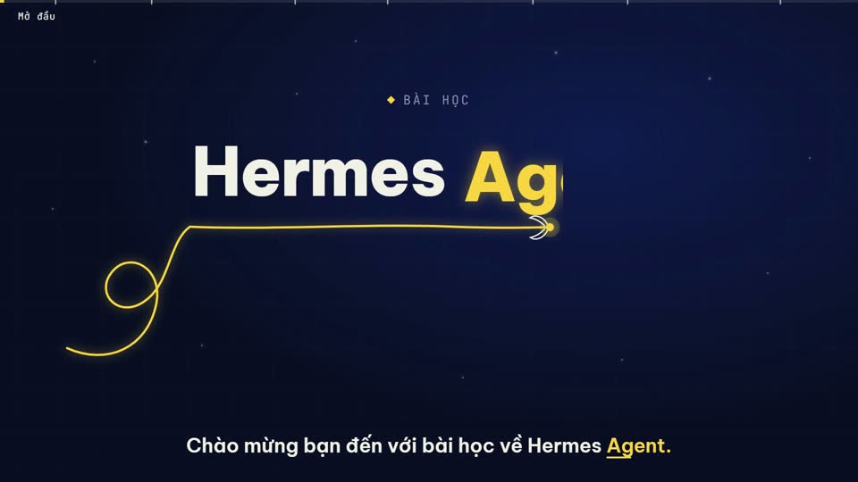 |
| 2 | [Một trợ lý biết tự học](hermes-agent-explainer/compositions/frames/02-mot-tro-ly-biet-tu-hoc.html) | ch0 | `kinetic@0-3.51, metaphor@3.51-8.26, typewriter@8.26-11.26` | kinetic-type-beats (Adapt) | 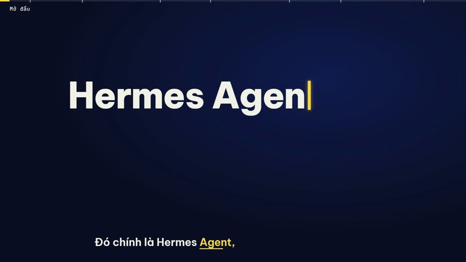 |
| 3 | [Miễn phí và chạy ở đâu cũng được](hermes-agent-explainer/compositions/frames/03-mien-phi-va-chay-o-dau-cung-duoc.html) | ch0 | `cards@0-3.01, hub@3.01-9.16, stat@9.16-12.37` | dataviz-countup (Adapt) | 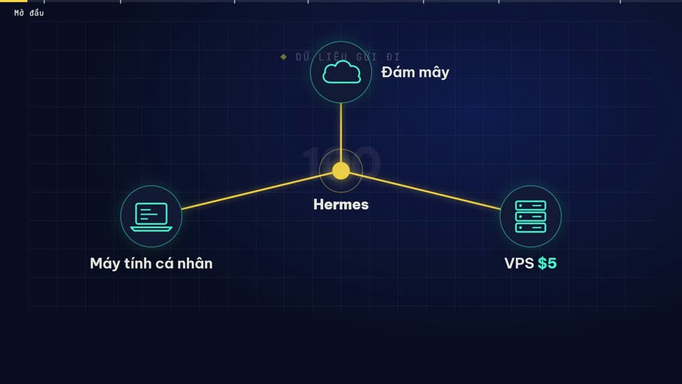 |
| 4 | [Sau bài học này](hermes-agent-explainer/compositions/frames/04-sau-bai-hoc-nay.html) | ch0 | `anchor@0-8.06, journey@8.06-11.93` | fixed-anchor-cycle (Adapt) | 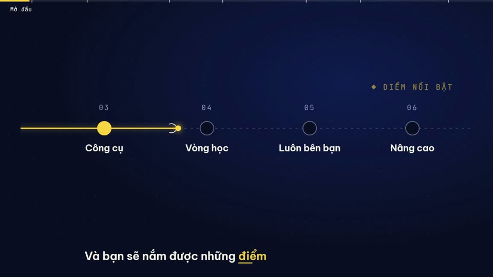 |
| 5 | [Agent là gì?](hermes-agent-explainer/compositions/frames/05-agent-la-gi.html) | ch1 | `title@0-3.01` | titlecard-reveal (Adapt) | 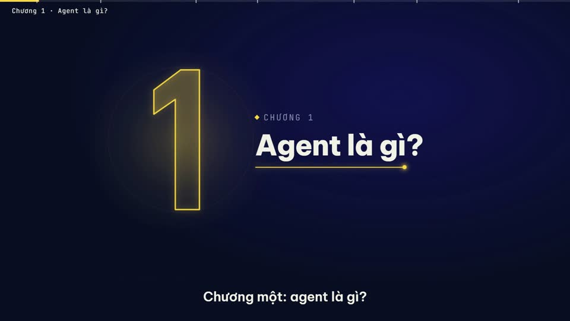 |
| 6 | [Chatbot chỉ trả lời](hermes-agent-explainer/compositions/frames/06-chatbot-chi-tra-loi.html) | ch1 | `split@0-5.93, cards@5.93-12.94` | comparison-split (Adapt) | 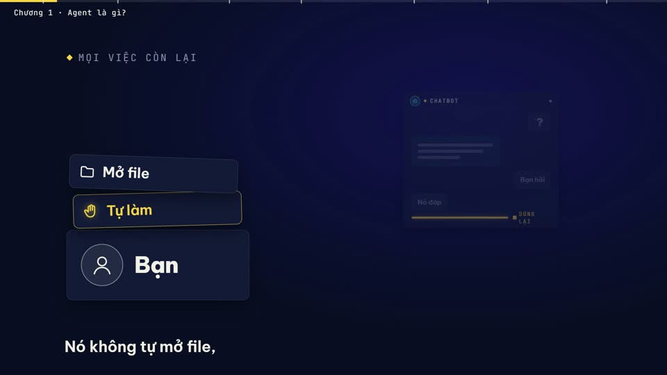 |
| 7 | [Agent thì bắt tay vào làm](hermes-agent-explainer/compositions/frames/07-agent-thi-bat-tay-vao-lam.html) | ch1 | `split@0-2.28, metaphor@2.28-6.36, stat@6.36-10.72` | compose | 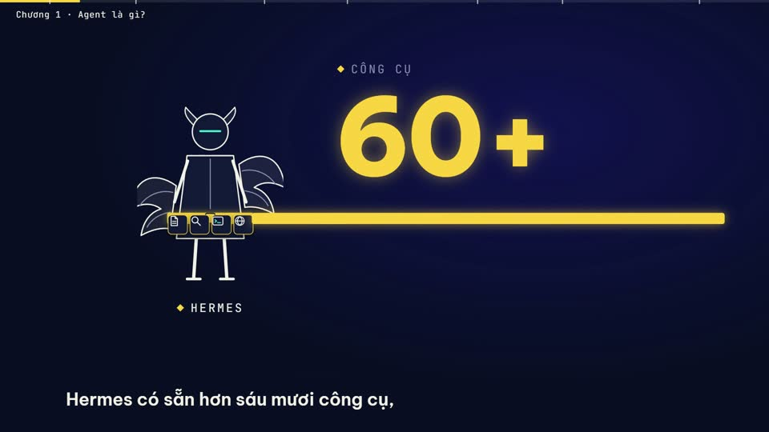 |
| 8 | [Vòng lặp của một agent](hermes-agent-explainer/compositions/frames/08-vong-lap-cua-mot-agent.html) | ch1 | `kinetic@0-2.22, flow@2.22-11.85, zoom@11.85-16.42` | agent-progress-theater (Adapt) |  |
| 9 | [Một ví dụ đời thường](hermes-agent-explainer/compositions/frames/09-mot-vi-du-doi-thuong.html) | ch1 | `typewriter@0-3.43, flow@3.43-9.92, journey@9.92-13.33` | prompt-type-submit-generate (Adapt) | 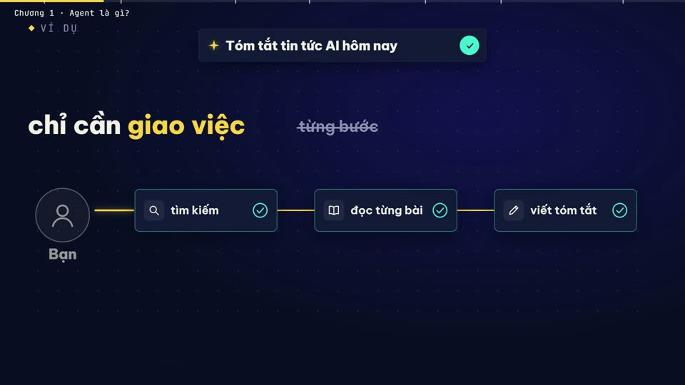 |
| 10 | [Hermes không chỉ là chatbot](hermes-agent-explainer/compositions/frames/10-hermes-khong-chi-la-chatbot.html) | ch1 | `kinetic@0-5.32, zoom@5.32-8.43` | zoom-out-workspace-reveal (Reproduce) | 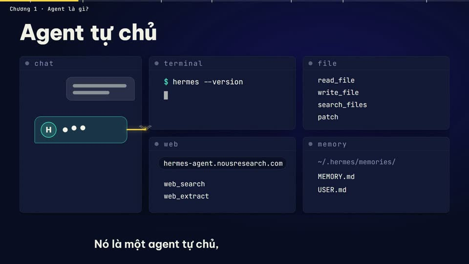 |
| 11 | [Tóm tắt chương một](hermes-agent-explainer/compositions/frames/11-tom-tat-chuong-mot.html) | ch1 | `anchor@0-3.71` | fixed-anchor-cycle (Adapt) |  |
| 12 | [Cài đặt và trò chuyện đầu tiên](hermes-agent-explainer/compositions/frames/12-cai-dat-va-tro-chuyen-dau-tien.html) | ch2 | `title@0-3.94` | titlecard-reveal (Adapt) |  |
| 13 | [Một dòng lệnh là xong](hermes-agent-explainer/compositions/frames/13-mot-dong-lenh-la-xong.html) | ch2 | `kinetic@0-1.72, terminal@1.72-8.48, zoom@8.48-13.12` | prompt-type-submit-generate (Adapt) | 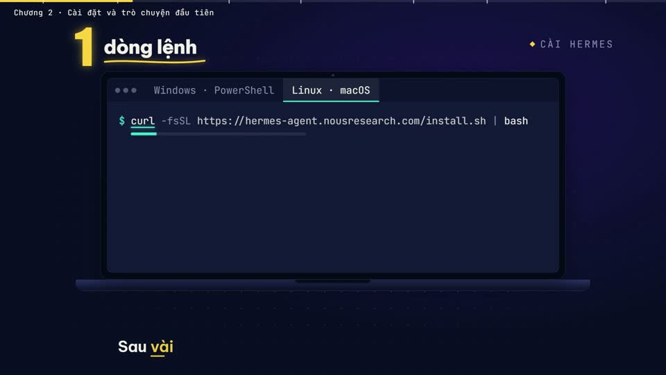 |
| 14 | [Cách nhanh nhất cho người mới](hermes-agent-explainer/compositions/frames/14-cach-nhanh-nhat-cho-nguoi-moi.html) | ch2 | `typewriter@0-2.72, journey@2.72-8.62, stat@8.62-13.11` | spatial-pan-stations (Adapt) |  |
| 15 | [Trình cài đặt lo hết](hermes-agent-explainer/compositions/frames/15-trinh-cai-dat-lo-het.html) | ch2 | `cards@0-7.2, kinetic@7.2-11.76` | grid-card-assemble (Adapt) |  |
| 16 | [Chọn bộ não cho Hermes](hermes-agent-explainer/compositions/frames/16-chon-bo-nao-cho-hermes.html) | ch2 | `terminal@0-4.49, hub@4.49-10.48, metaphor@10.48-15.45` | prompt-type-submit-generate (Adapt) | 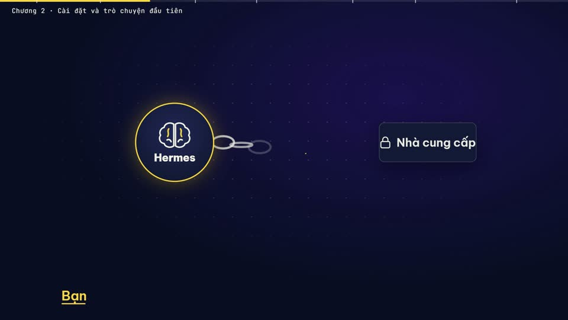 |
| 17 | [Lưu ý về bộ nhớ ngữ cảnh](hermes-agent-explainer/compositions/frames/17-luu-y-ve-bo-nho-ngu-canh.html) | ch2 | `stat@0-7.39, kinetic@7.39-11.09` | dataviz-countup (Reproduce) |  |
| 18 | [Hai giao diện dòng lệnh](hermes-agent-explainer/compositions/frames/18-hai-giao-dien-dong-lenh.html) | ch2 | `typewriter@0-3.11, split@3.11-10.48, terminal@10.48-14.23` | comparison-split (Adapt) |  |
| 19 | [Thanh trạng thái](hermes-agent-explainer/compositions/frames/19-thanh-trang-thai.html) | ch2 | `zoom@0-3.94, stat@3.94-8.14` | zoom-out-workspace-reveal (Adapt) |  |
| 20 | [Khóa bí mật và cài đặt](hermes-agent-explainer/compositions/frames/20-khoa-bi-mat-va-cai-dat.html) | ch2 | `split@0-7.83` | comparison-split (Reproduce) | 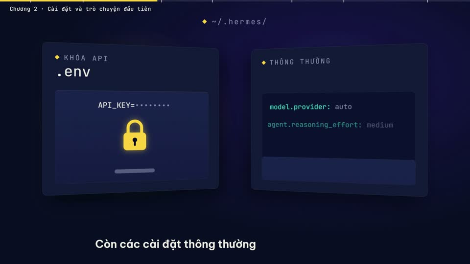 |
| 21 | [Tóm tắt chương hai](hermes-agent-explainer/compositions/frames/21-tom-tat-chuong-hai.html) | ch2 | `anchor@0-3.49` | fixed-anchor-cycle (Adapt) |  |
| 22 | [Công cụ và bộ công cụ](hermes-agent-explainer/compositions/frames/22-cong-cu-va-bo-cong-cu.html) | ch3 | `title@0-3.75` | titlecard-reveal (Adapt) |  |
| 23 | [Những công cụ quen thuộc](hermes-agent-explainer/compositions/frames/23-nhung-cong-cu-quen-thuoc.html) | ch3 | `metaphor@0-2.32, cards@2.32-11.63` | grid-card-assemble (Reproduce) | 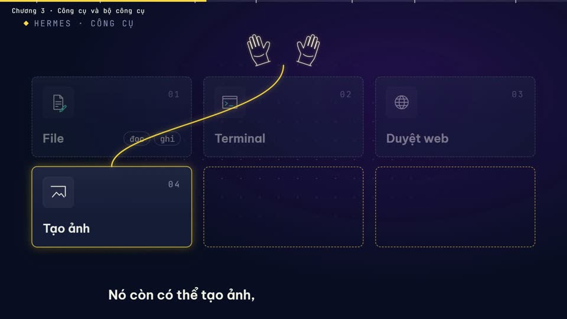 |
| 24 | [Bộ công cụ là gì?](hermes-agent-explainer/compositions/frames/24-bo-cong-cu-la-gi.html) | ch3 | `kinetic@0-2.98, metaphor@2.98-8.57, cards@8.57-13.42` | compose | 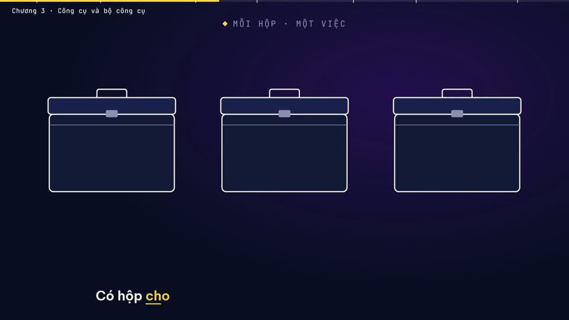 |
| 25 | [Hộp đồ nghề cho lập trình](hermes-agent-explainer/compositions/frames/25-hop-do-nghe-cho-lap-trinh.html) | ch3 | `hub@0-5.16, split@5.16-10.45, flow@10.45-14.4` | constellation-hub (Reproduce) | 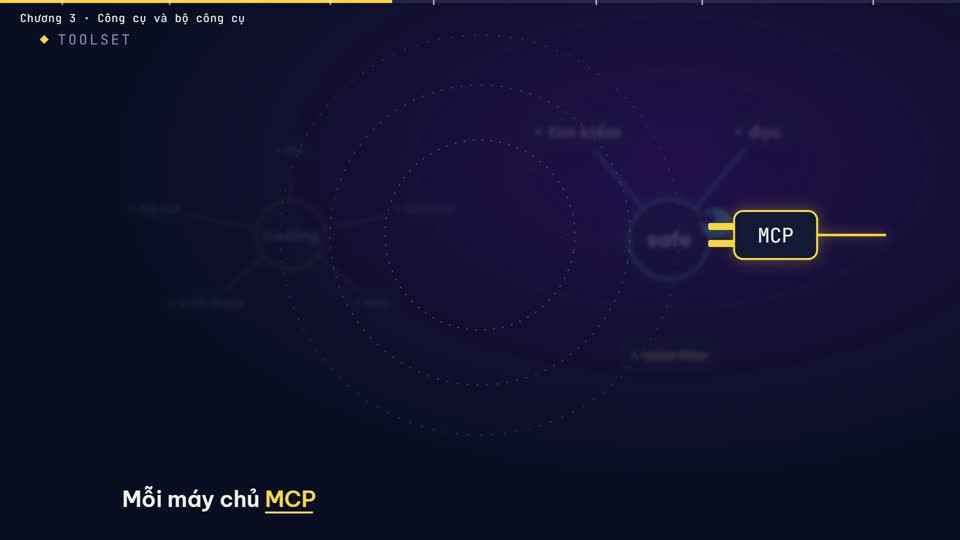 |
| 26 | [Bật tắt công cụ](hermes-agent-explainer/compositions/frames/26-bat-tat-cong-cu.html) | ch3 | `terminal@0-3.58, split@3.58-6.53, terminal@6.53-10.94` | prompt-type-submit-generate (Adapt) |  |
| 27 | [Vì sao nên chọn lọc?](hermes-agent-explainer/compositions/frames/27-vi-sao-nen-chon-loc.html) | ch3 | `kinetic@0-3.6, stat@3.6-7.91` | kinetic-type-beats (Adapt) | 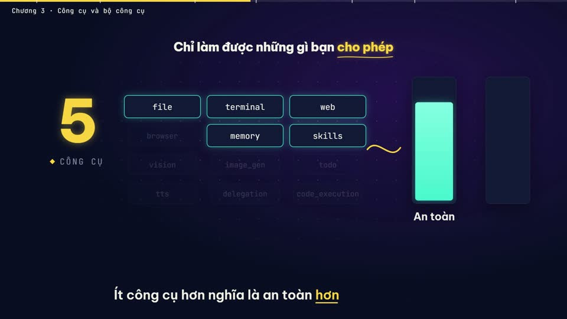 |
| 28 | [Tóm tắt chương ba](hermes-agent-explainer/compositions/frames/28-tom-tat-chuong-ba.html) | ch3 | `anchor@0-4.04` | fixed-anchor-cycle (Adapt) | 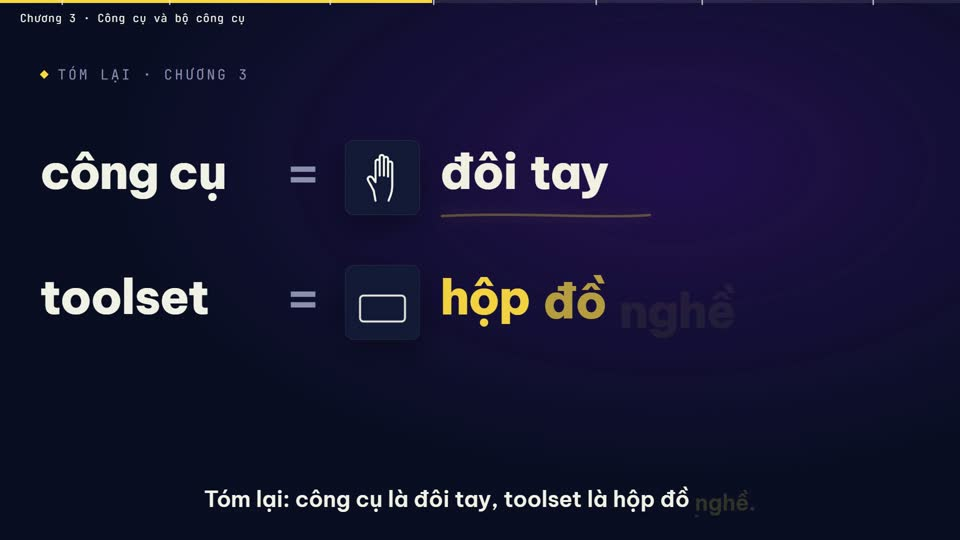 |
| 29 | [Vòng học khép kín](hermes-agent-explainer/compositions/frames/29-vong-hoc-khep-kin.html) | ch4 | `title@0-3.17` | titlecard-reveal (Adapt) |  |
| 30 | [Vòng học là gì?](hermes-agent-explainer/compositions/frames/30-vong-hoc-la-gi.html) | ch4 | `kinetic@0-3.73, flow@3.73-11.16` | agent-progress-theater (Adapt) | 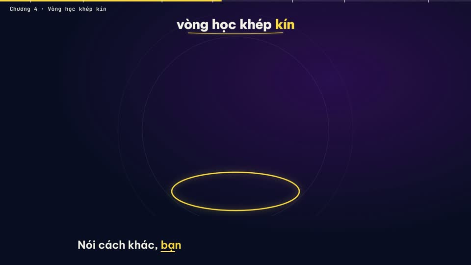 |
| 31 | [Hai cuốn sổ ghi nhớ](hermes-agent-explainer/compositions/frames/31-hai-cuon-so-ghi-nho.html) | ch4 | `metaphor@0-5.36, zoom@5.36-10.8, stat@10.8-14.49` | compose | 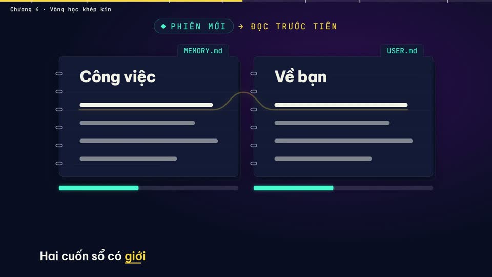 |
| 32 | [Tìm lại cuộc trò chuyện cũ](hermes-agent-explainer/compositions/frames/32-tim-lai-cuoc-tro-chuyen-cu.html) | ch4 | `kinetic@0-3.78, terminal@3.78-8.08, zoom@8.08-11.54` | transcript-scroll-artifact-reveal (Adapt) |  |
| 33 | [Kỹ năng là trí nhớ về cách làm](hermes-agent-explainer/compositions/frames/33-ky-nang-la-tri-nho-ve-cach-lam.html) | ch4 | `metaphor@0-7.17, typewriter@7.17-11.09` | compose |  |
| 34 | [Tự tạo và tự cải thiện](hermes-agent-explainer/compositions/frames/34-tu-tao-va-tu-cai-thien.html) | ch4 | `flow@0-8.15, journey@8.15-11.22` | agent-progress-theater (Adapt) | 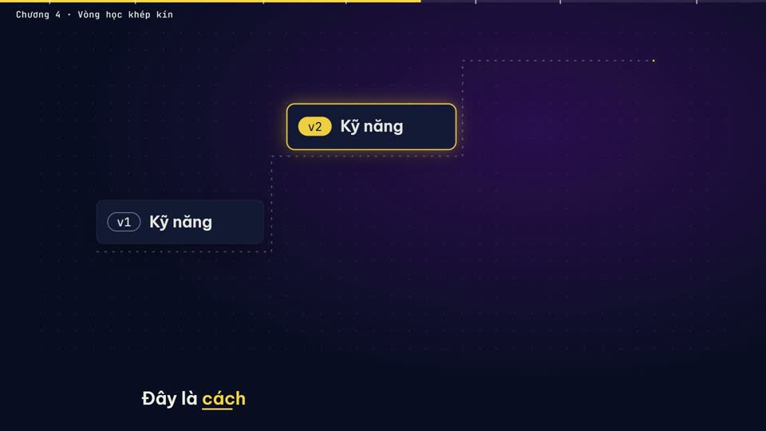 |
| 35 | [Kho kỹ năng cộng đồng](hermes-agent-explainer/compositions/frames/35-kho-ky-nang-cong-dong.html) | ch4 | `hub@0-3.56, flow@3.56-7.59` | constellation-hub (Adapt) | 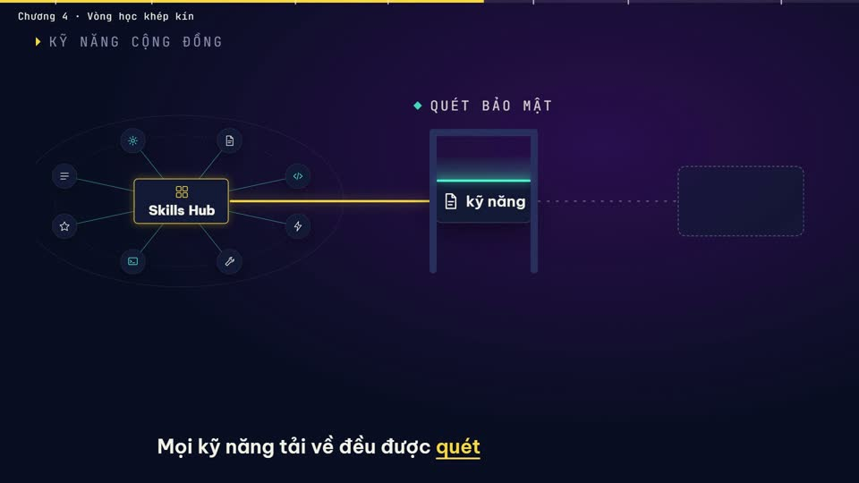 |
| 36 | [Dạy Hermes bằng lệnh learn](hermes-agent-explainer/compositions/frames/36-day-hermes-bang-lenh-learn.html) | ch4 | `typewriter@0-2.32, cards@2.32-8.63` | typewriter-reveal (Adapt) | 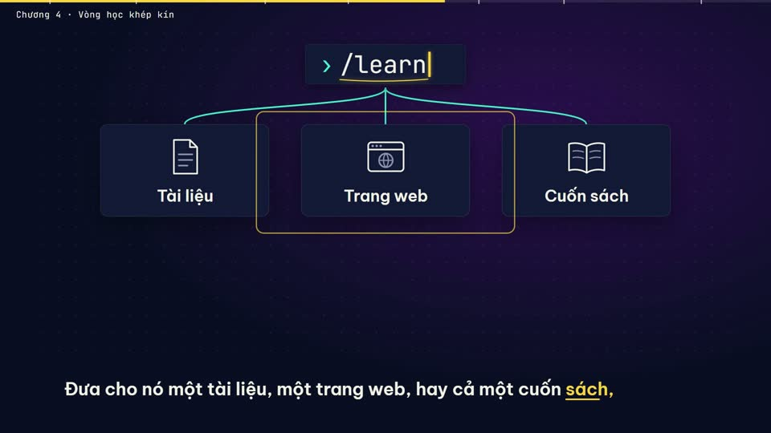 |
| 37 | [Người dọn dẹp kỹ năng](hermes-agent-explainer/compositions/frames/37-nguoi-don-dep-ky-nang.html) | ch4 | `metaphor@0-2.3, stat@2.3-8.75` | dataviz-countup (Adapt) | 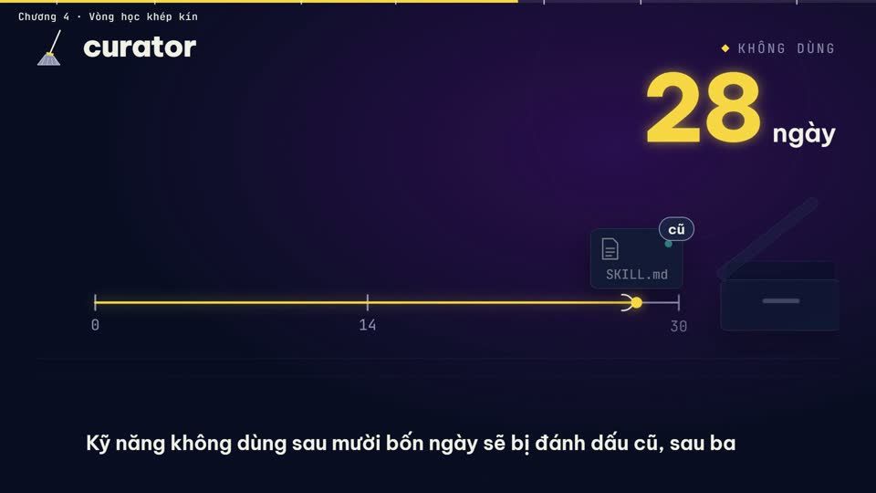 |
| 38 | [Hiểu bạn sâu hơn với Honcho](hermes-agent-explainer/compositions/frames/38-hieu-ban-sau-hon-voi-honcho.html) | ch4 | `hub@0-7.99, terminal@7.99-11.76` | constellation-hub (Adapt) |  |
| 39 | [Tóm tắt chương bốn](hermes-agent-explainer/compositions/frames/39-tom-tat-chuong-bon.html) | ch4 | `anchor@0-4.19` | fixed-anchor-cycle (Adapt) | 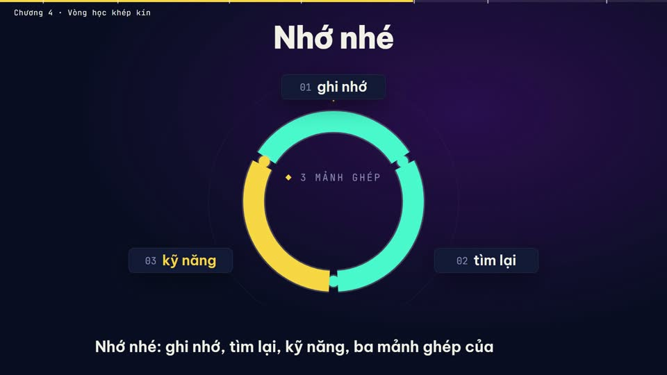 |
| 40 | [Luôn bên bạn](hermes-agent-explainer/compositions/frames/40-luon-ben-ban.html) | ch5 | `title@0-3.38` | titlecard-reveal (Adapt) |  |
| 41 | [Trò chuyện từ ứng dụng quen thuộc](hermes-agent-explainer/compositions/frames/41-tro-chuyen-tu-ung-dung-quen-thuoc.html) | ch5 | `kinetic@0-3.5, hub@3.5-12.26` | constellation-hub (Reproduce) | 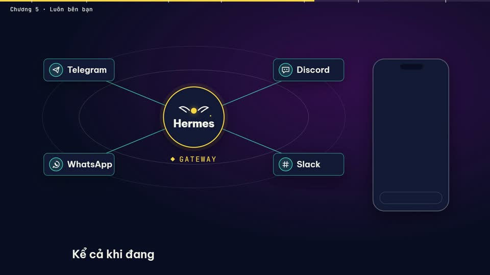 |
| 42 | [Hơn hai mươi nền tảng](hermes-agent-explainer/compositions/frames/42-hon-hai-muoi-nen-tang.html) | ch5 | `stat@0-6.76, flow@6.76-10.54` | dataviz-countup (Reproduce) | 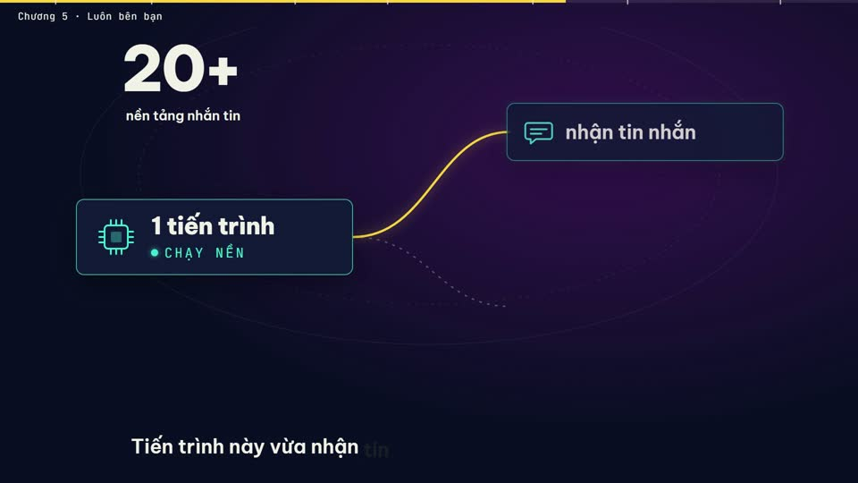 |
| 43 | [Thiết lập gateway](hermes-agent-explainer/compositions/frames/43-thiet-lap-gateway.html) | ch5 | `terminal@0-6.4, split@6.4-11.81` | prompt-type-submit-generate (Adapt) | 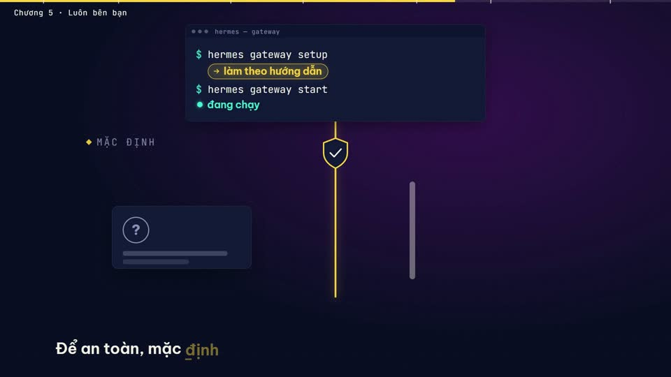 |
| 44 | [Việc tự động theo lịch](hermes-agent-explainer/compositions/frames/44-viec-tu-dong-theo-lich.html) | ch5 | `metaphor@0-3.64, typewriter@3.64-8.48, cards@8.48-12.02` | compose |  |
| 45 | [Ví dụ lịch tự động](hermes-agent-explainer/compositions/frames/45-vi-du-lich-tu-dong.html) | ch5 | `zoom@0-4.31, typewriter@4.31-7.72, flow@7.72-12.89` | zoom-out-workspace-reveal (Adapt) |  |
| 46 | [Tóm tắt chương năm](hermes-agent-explainer/compositions/frames/46-tom-tat-chuong-nam.html) | ch5 | `anchor@0-4.78` | fixed-anchor-cycle (Adapt) |  |
| 47 | [Nâng cao: những điểm nổi bật](hermes-agent-explainer/compositions/frames/47-nang-cao-nhung-diem-noi-bat.html) | ch6 | `title@0-3.56` | titlecard-reveal (Adapt) |  |
| 48 | [Chỉ cần nắm ý chính](hermes-agent-explainer/compositions/frames/48-chi-can-nam-y-chinh.html) | ch6 | `kinetic@0-4.37` | kinetic-type-beats (Adapt) |  |
| 49 | [Agent con làm việc song song](hermes-agent-explainer/compositions/frames/49-agent-con-lam-viec-song-song.html) | ch6 | `flow@0-7.78, cards@7.78-13.01` | agent-progress-theater (Adapt) |  |
| 50 | [Viết code để gọi công cụ](hermes-agent-explainer/compositions/frames/50-viet-code-de-goi-cong-cu.html) | ch6 | `split@0-7.95, stat@7.95-11.85` | comparison-split (Adapt) |  |
| 51 | [MCP – cổng cắm chung](hermes-agent-explainer/compositions/frames/51-mcp-cong-cam-chung.html) | ch6 | `metaphor@0-4.16, hub@4.16-10.12, terminal@10.12-14.44` | constellation-hub (Adapt) |  |
| 52 | [Bảy môi trường chạy lệnh](hermes-agent-explainer/compositions/frames/52-bay-moi-truong-chay-lenh.html) | ch6 | `stat@0-4.36, cards@4.36-9.28` | dataviz-countup (Adapt) |  |
| 53 | [Ngủ đông khi rảnh](hermes-agent-explainer/compositions/frames/53-ngu-dong-khi-ranh.html) | ch6 | `zoom@0-5.58, stat@5.58-9.07` | zoom-out-workspace-reveal (Adapt) | 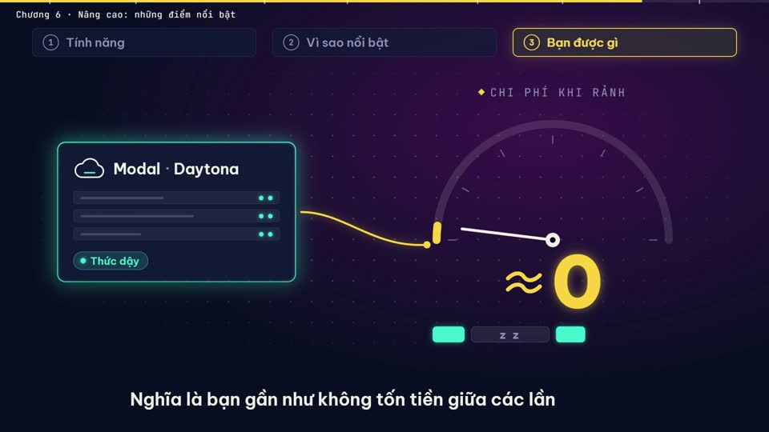 |
| 54 | [SOUL.md – linh hồn của agent](hermes-agent-explainer/compositions/frames/54-soul-md-linh-hon-cua-agent.html) | ch6 | `typewriter@0-4.64, metaphor@4.64-9.64, kinetic@9.64-14.27` | typewriter-reveal (Adapt) |  |
| 55 | [Tệp ngữ cảnh cho dự án](hermes-agent-explainer/compositions/frames/55-tep-ngu-canh-cho-du-an.html) | ch6 | `cards@0-8.37, zoom@8.37-12.88` | grid-card-assemble (Adapt) | 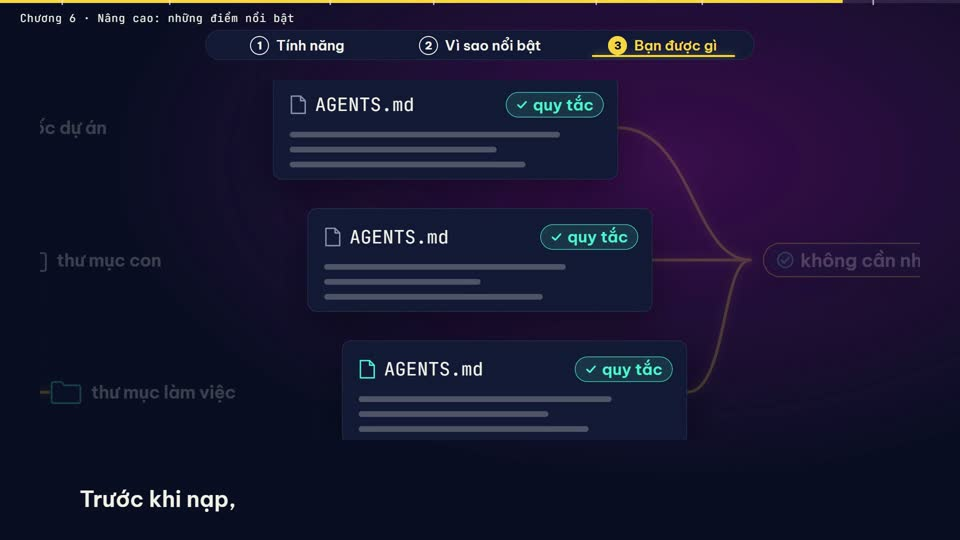 |
| 56 | [Vì sao những điều này quan trọng?](hermes-agent-explainer/compositions/frames/56-vi-sao-nhung-dieu-nay-quan-trong.html) | ch6 | `journey@0-5.39, kinetic@5.39-9.14` | spatial-pan-stations (Adapt) | 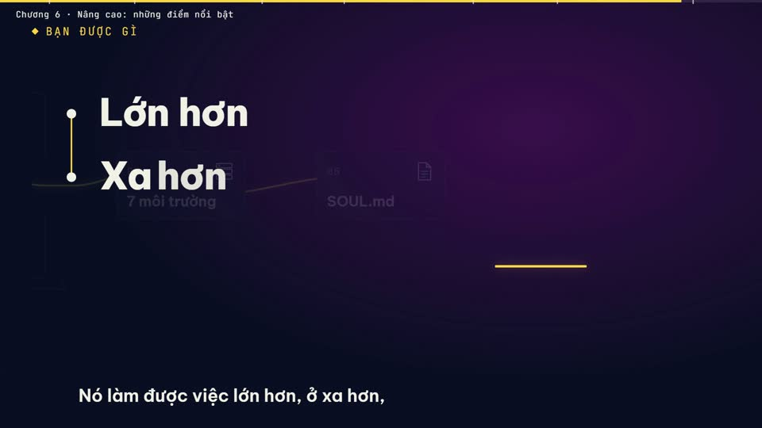 |
| 57 | [Tóm tắt chương sáu](hermes-agent-explainer/compositions/frames/57-tom-tat-chuong-sau.html) | ch6 | `anchor@0-6.94` | fixed-anchor-cycle (Adapt) |  |
| 58 | [Dùng an toàn và tổng kết](hermes-agent-explainer/compositions/frames/58-dung-an-toan-va-tong-ket.html) | ch7 | `title@0-3.36` | titlecard-reveal (Adapt) |  |
| 59 | [Hỏi trước khi làm việc nguy hiểm](hermes-agent-explainer/compositions/frames/59-hoi-truoc-khi-lam-viec-nguy-hiem.html) | ch7 | `kinetic@0-2.94, flow@2.94-6.76, stat@6.76-11.74, metaphor@11.74-16.51` | agent-progress-theater (Adapt) |  |
| 60 | [Bảo vệ bí mật của bạn](hermes-agent-explainer/compositions/frames/60-bao-ve-bi-mat-cua-ban.html) | ch7 | `cards@0-3.01, zoom@3.01-7.87, hub@7.87-11.81` | grid-card-assemble (Adapt) | 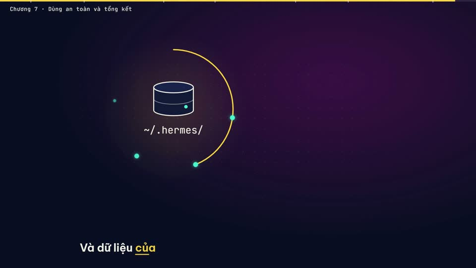 |
| 61 | [Luôn có đường lui](hermes-agent-explainer/compositions/frames/61-luon-co-duong-lui.html) | ch7 | `zoom@0-2.96, journey@2.96-7.68` | camera-journey (Adapt) | 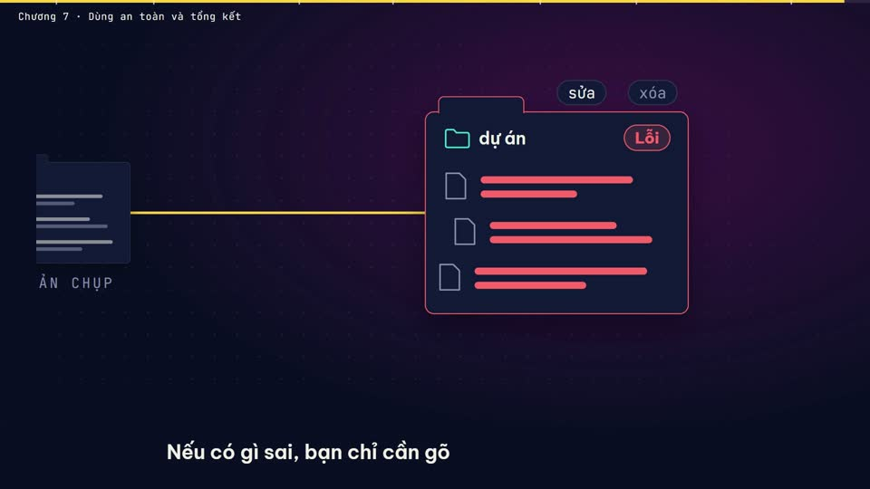 |
| 62 | [Tổng kết bài học](hermes-agent-explainer/compositions/frames/62-tong-ket-bai-hoc.html) | ch7 | `anchor@0-5.42, cards@5.42-8.79` | fixed-anchor-cycle (Adapt) |  |
| 63 | [Bước tiếp theo](hermes-agent-explainer/compositions/frames/63-buoc-tiep-theo.html) | ch7 | `kinetic@0-4.25, typewriter@4.25-7.36` | kinetic-type-beats (Adapt) | 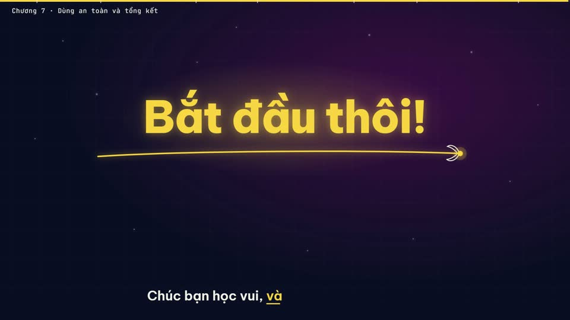 |

## claude-intro-explainer

| # | frame | chapter | shots | blueprint | preview |
|---|---|---|---|---|---|
| 1 | [Claude – từ cơ bản đến chuyên sâu](claude-intro-explainer/compositions/frames/01-claude-tu-co-ban-den-chuyen-sau.html) | ch0 | `title@0-4.3` | titlecard-reveal (Adapt) | 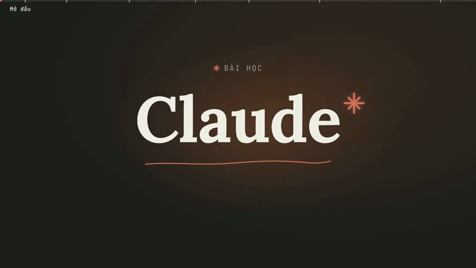 |
| 2 | [Một đồng nghiệp luôn sẵn sàng](claude-intro-explainer/compositions/frames/02-mot-dong-nghiep-luon-san-sang.html) | ch0 | `kinetic@0-3.9, cards@3.9-8.2, typewriter@8.2-11.76, metaphor@11.76-15.3` | kinetic-type-beats (Adapt) | 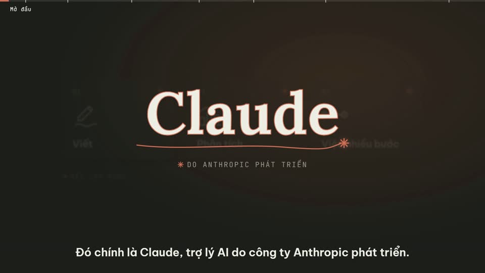 |
| 3 | [Claude ở khắp nơi](claude-intro-explainer/compositions/frames/03-claude-o-khap-noi.html) | ch0 | `hub@0-4.02, cards@4.02-10.33, zoom@10.33-11.46` | constellation-hub (Adapt) | 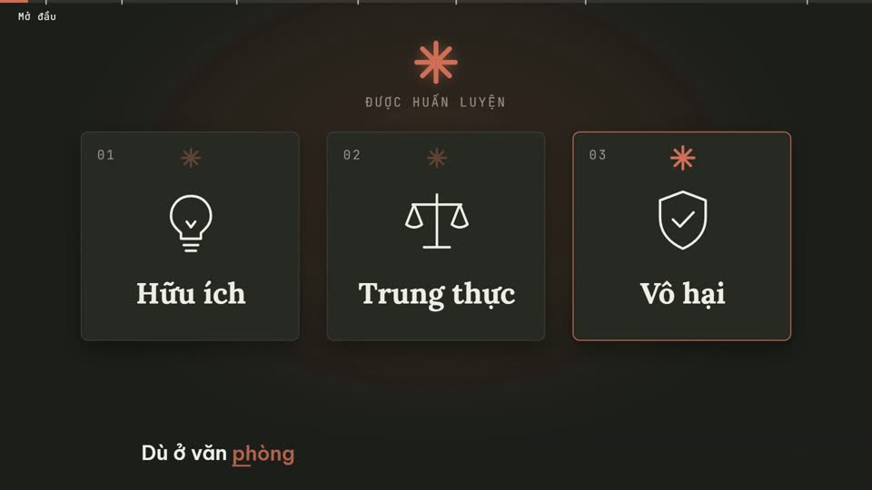 |
| 4 | [Sau bài học này](claude-intro-explainer/compositions/frames/04-sau-bai-hoc-nay.html) | ch0 | `anchor@0-7.8, kinetic@7.8-11.11, journey@11.11-14.81` | fixed-anchor-cycle (Adapt) |  |
| 5 | [Làm quen với Claude](claude-intro-explainer/compositions/frames/05-lam-quen-voi-claude.html) | ch1 | `title@0-3.29` | titlecard-reveal (Adapt) | 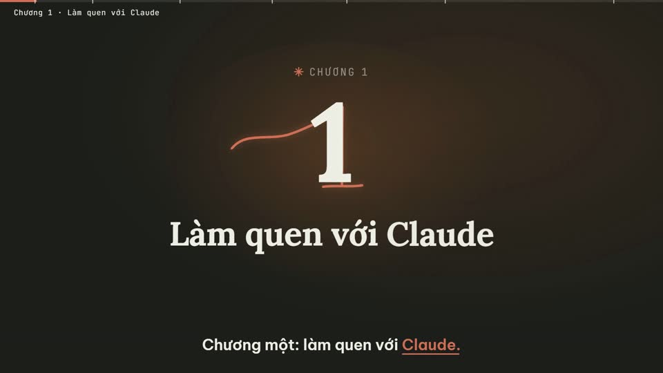 |
| 6 | [Tìm kiếm và trò chuyện](claude-intro-explainer/compositions/frames/06-tim-kiem-va-tro-chuyen.html) | ch1 | `split@0-6.88, flow@6.88-10.26, metaphor@10.26-14.93` | compose | 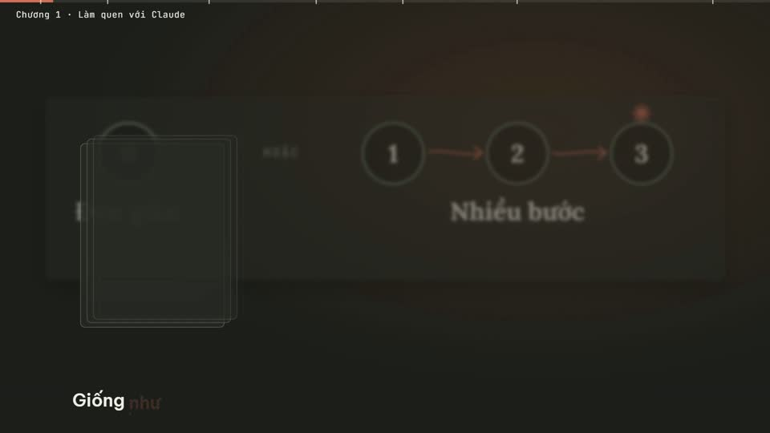 |
| 7 | [Họ nhà Claude](claude-intro-explainer/compositions/frames/07-ho-nha-claude.html) | ch1 | `kinetic@0-3.91, cards@3.91-9.24, journey@9.24-13.3` | grid-card-assemble (Adapt) | 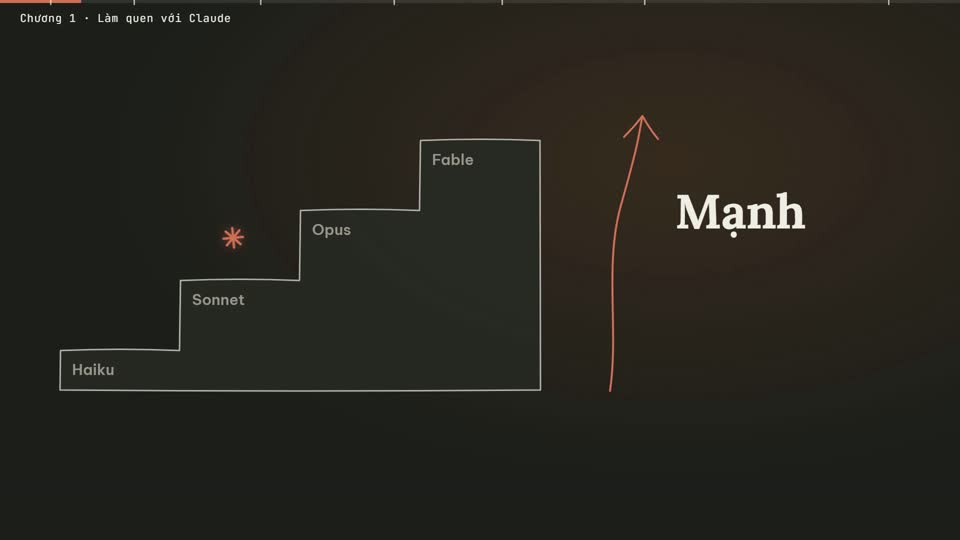 |
| 8 | [Chọn model như chọn người giúp việc](claude-intro-explainer/compositions/frames/08-chon-model-nhu-chon-nguoi-giup-viec.html) | ch1 | `metaphor@0-4.07, split@4.07-6.33, typewriter@6.33-10.61` | compose | 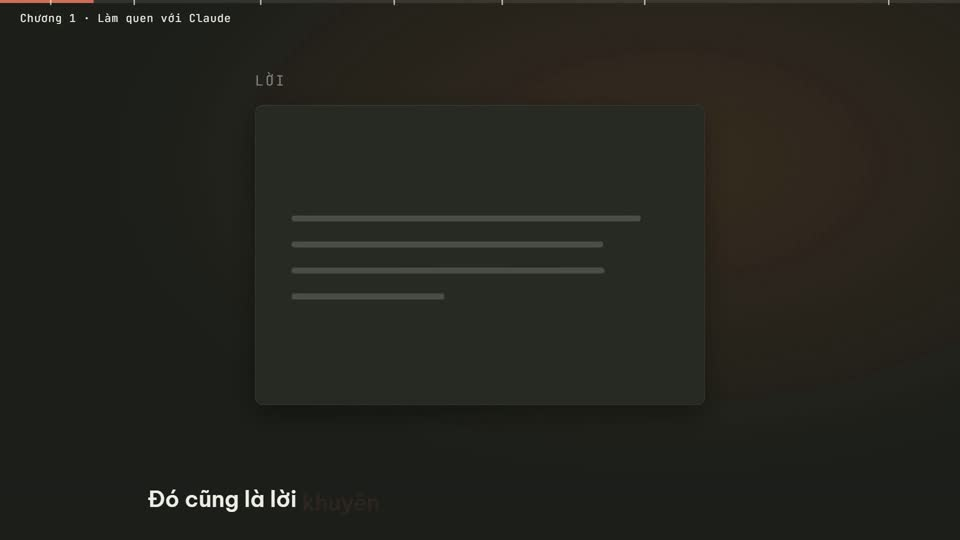 |
| 9 | [Nhiều cách để làm việc với Claude](claude-intro-explainer/compositions/frames/09-nhieu-cach-de-lam-viec-voi-claude.html) | ch1 | `kinetic@0-3.39, hub@3.39-11.87, flow@11.87-15.25` | constellation-hub (Adapt) | 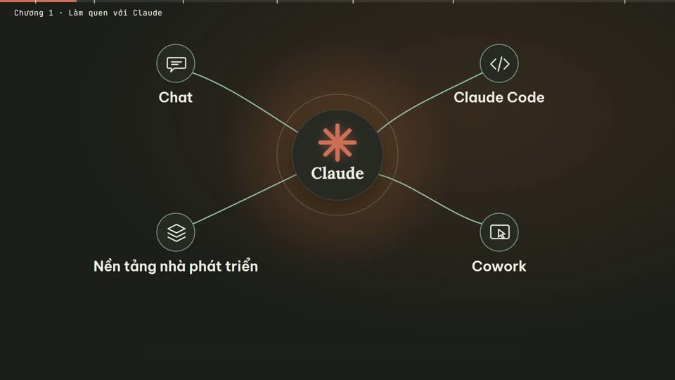 |
| 10 | [Đồng bộ trên mọi thiết bị](claude-intro-explainer/compositions/frames/10-dong-bo-tren-moi-thiet-bi.html) | ch1 | `zoom@0-5.36, flow@5.36-7.42, cards@7.42-11.73` | zoom-out-workspace-reveal (Adapt) | 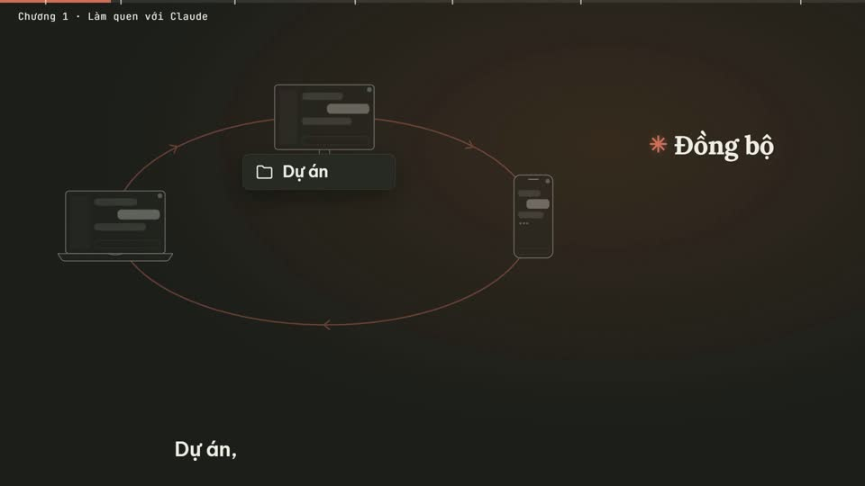 |
| 11 | [Tóm tắt chương một](claude-intro-explainer/compositions/frames/11-tom-tat-chuong-mot.html) | ch1 | `anchor@0-4.02, kinetic@4.02-6.97` | fixed-anchor-cycle (Adapt) | 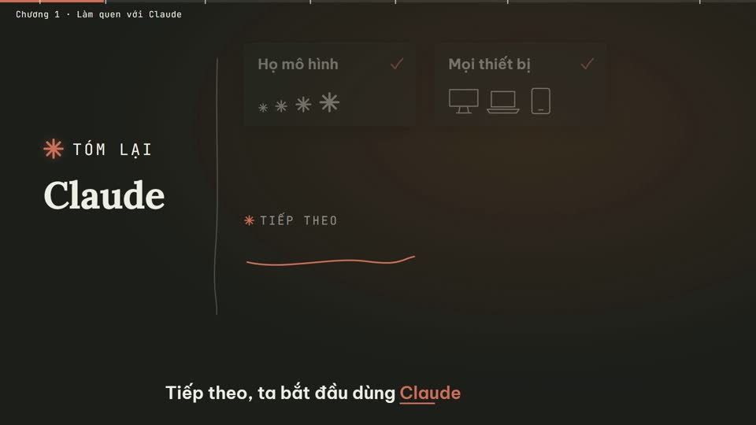 |
| 12 | [Cơ bản trên claude.ai](claude-intro-explainer/compositions/frames/12-co-ban-tren-claude-ai.html) | ch2 | `title@0-4.15` | titlecard-reveal (Adapt) | 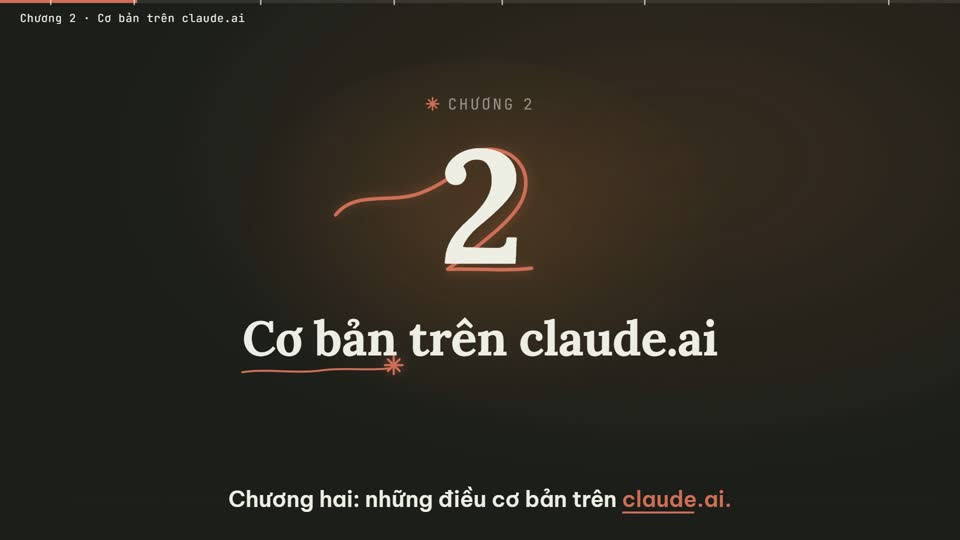 |
| 13 | [Màn hình đầu tiên](claude-intro-explainer/compositions/frames/13-man-hinh-dau-tien.html) | ch2 | `screen@0-4.35, kinetic@4.35-9.27` | compose | _(private screenshot)_ |
| 14 | [Câu hỏi đầu tiên](claude-intro-explainer/compositions/frames/14-cau-hoi-dau-tien.html) | ch2 | `typewriter@0-9.08, cards@9.08-13.26, kinetic@13.26-14.65` | typewriter-reveal (Adapt) | 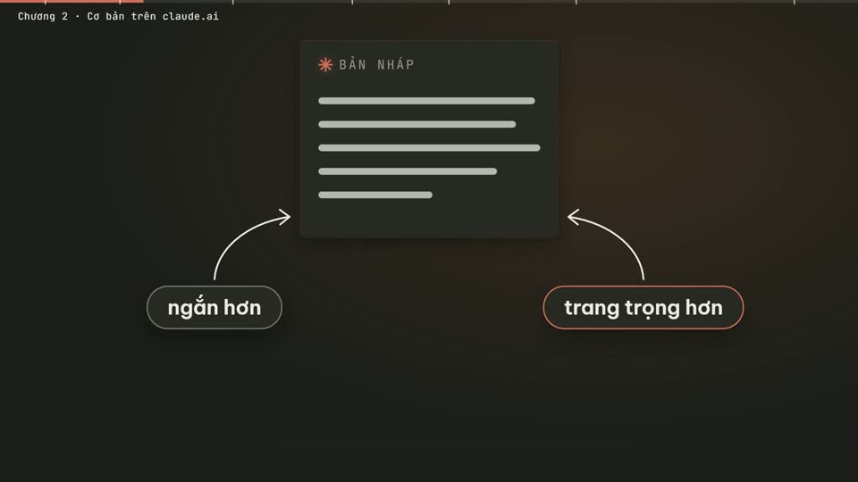 |
| 15 | [Tải file lên](claude-intro-explainer/compositions/frames/15-tai-file-len.html) | ch2 | `screen@0-5.19, flow@5.19-8.12` | compose | _(private screenshot)_ |
| 16 | [File nào cũng đọc được](claude-intro-explainer/compositions/frames/16-file-nao-cung-doc-duoc.html) | ch2 | `cards@0-4.55, kinetic@4.55-9.28, split@9.28-16.7` | grid-card-assemble (Adapt) | 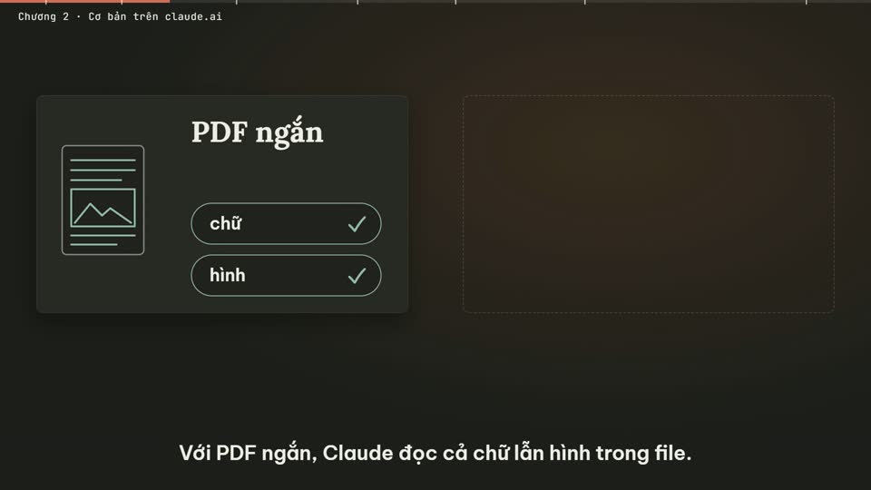 |
| 17 | [Những con số cần biết](claude-intro-explainer/compositions/frames/17-nhung-con-so-can-biet.html) | ch2 | `stat@0-9.79, zoom@9.79-14.49` | dataviz-countup (Adapt) | 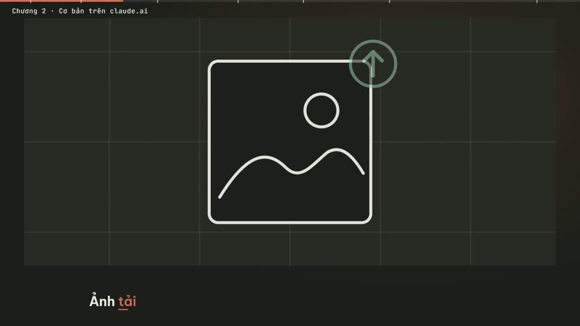 |
| 18 | [Cách hỏi để được trả lời hay](claude-intro-explainer/compositions/frames/18-cach-hoi-de-duoc-tra-loi-hay.html) | ch2 | `flow@0-8.14, typewriter@8.14-14.65` | compose | 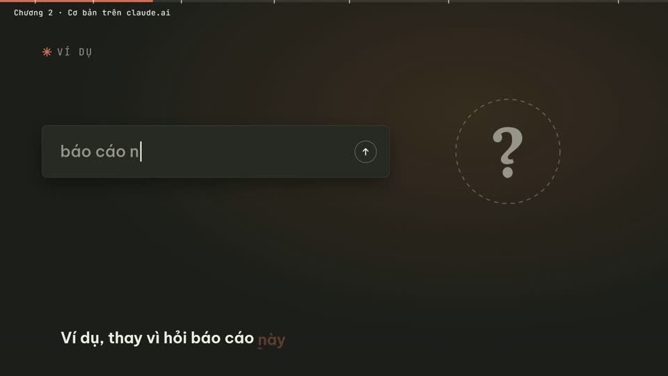 |
| 19 | [Hỏi chung chung và hỏi cụ thể](claude-intro-explainer/compositions/frames/19-hoi-chung-chung-va-hoi-cu-the.html) | ch2 | `split@0-8.9, metaphor@8.9-12.45` | compose |  |
| 20 | [Sửa và hỏi tiếp](claude-intro-explainer/compositions/frames/20-sua-va-hoi-tiep.html) | ch2 | `journey@0-7.34, flow@7.34-12.94` | spatial-pan-stations (Adapt) | 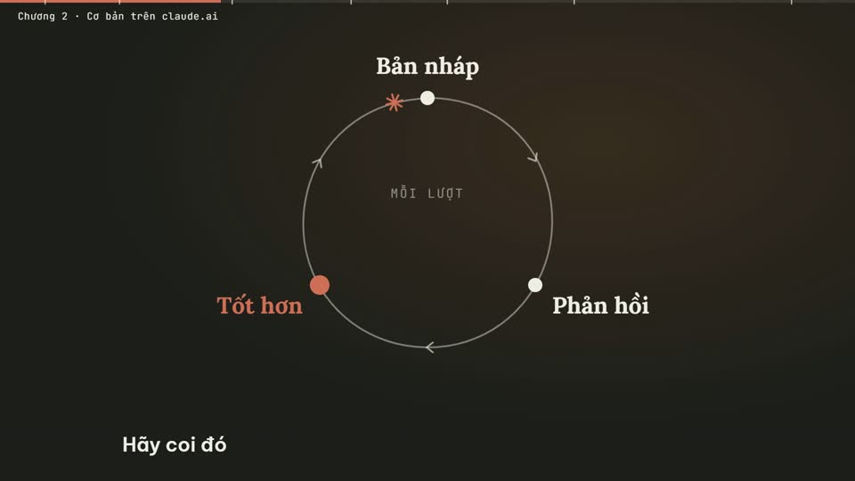 |
| 21 | [Tóm tắt chương hai](claude-intro-explainer/compositions/frames/21-tom-tat-chuong-hai.html) | ch2 | `anchor@0-6.3, kinetic@6.3-7.88` | fixed-anchor-cycle (Adapt) | 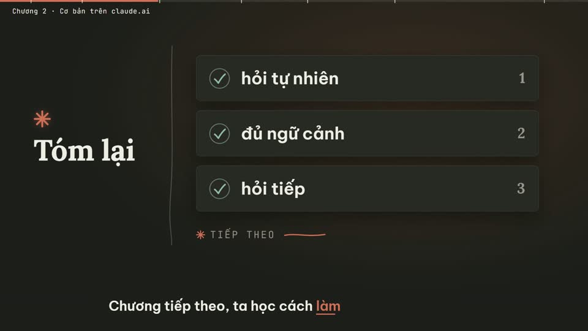 |
| 22 | [Làm việc có tổ chức](claude-intro-explainer/compositions/frames/22-lam-viec-co-to-chuc.html) | ch3 | `title@0-3.81` | titlecard-reveal (Adapt) | 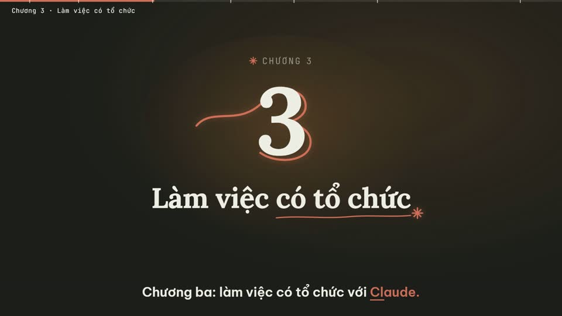 |
| 23 | [Mỗi dự án một ngăn kéo](claude-intro-explainer/compositions/frames/23-moi-du-an-mot-ngan-keo.html) | ch3 | `metaphor@0-6.82, zoom@6.82-11.98` | compose | 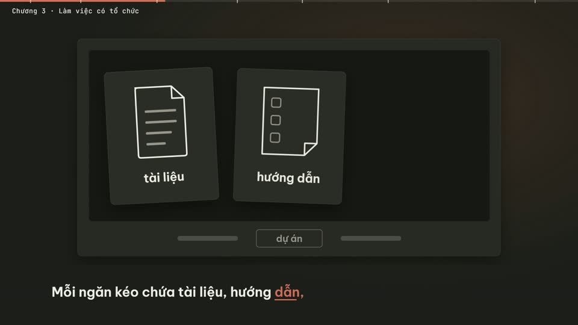 |
| 24 | [Bên trong một Project](claude-intro-explainer/compositions/frames/24-ben-trong-mot-project.html) | ch3 | `screen@0-5.66, split@5.66-7.57, screen@7.57-11.97, hub@11.97-14.2` | compose | _(private screenshot)_ |
| 25 | [Không có và có Project](claude-intro-explainer/compositions/frames/25-khong-co-va-co-project.html) | ch3 | `split@0-7.91, cards@7.91-12.18` | compose | 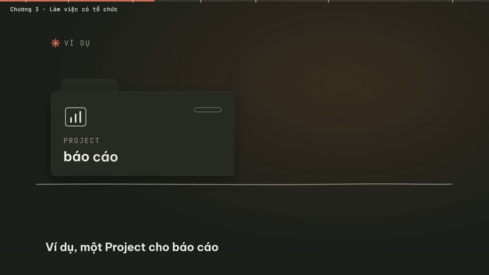 |
| 26 | [Artifact là gì?](claude-intro-explainer/compositions/frames/26-artifact-la-gi.html) | ch3 | `kinetic@0-5.18, hub@5.18-10.3` | kinetic-type-beats (Adapt) | 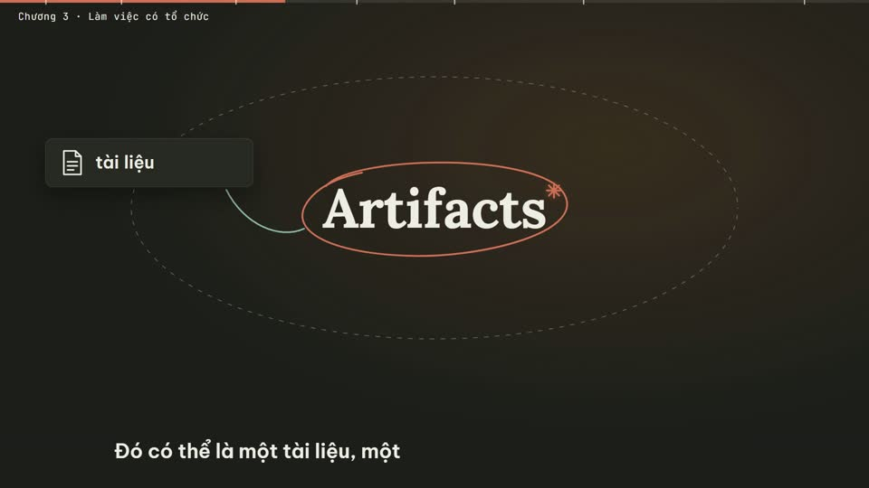 |
| 27 | [Artifact ngay bên cạnh cuộc trò chuyện](claude-intro-explainer/compositions/frames/27-artifact-ngay-ben-canh-cuoc-tro-chuyen.html) | ch3 | `screen@0-7.85, stat@7.85-11.09` | compose | _(private screenshot)_ |
| 28 | [Docs, Slides và Design](claude-intro-explainer/compositions/frames/28-docs-slides-va-design.html) | ch3 | `cards@0-7.59, zoom@7.59-13.04, kinetic@13.04-16.2` | grid-card-assemble (Adapt) | 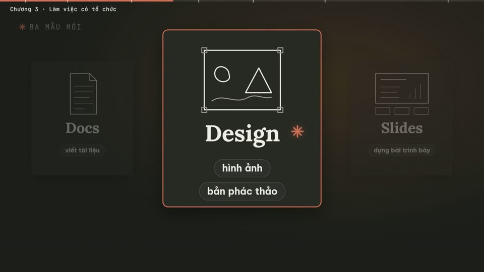 |
| 29 | [Claude biết ghi nhớ](claude-intro-explainer/compositions/frames/29-claude-biet-ghi-nho.html) | ch3 | `metaphor@0-5.79, typewriter@5.79-9.89` | compose | 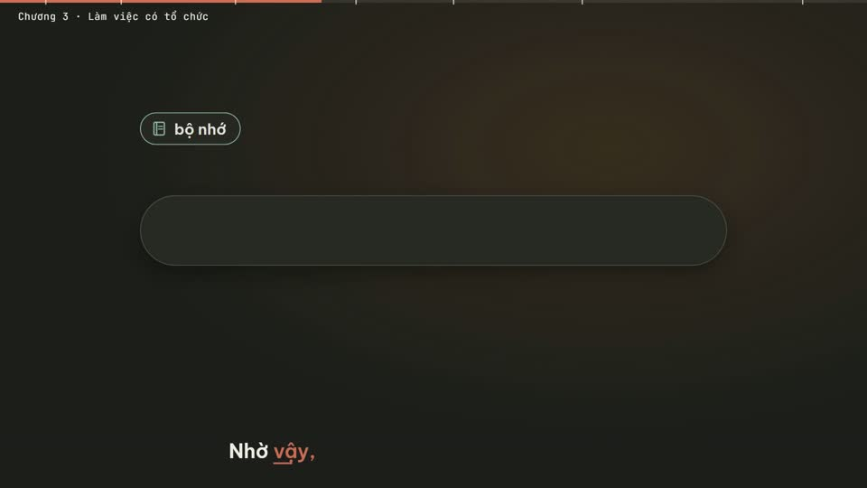 |
| 30 | [Nhớ có chọn lọc](claude-intro-explainer/compositions/frames/30-nho-co-chon-loc.html) | ch3 | `zoom@0-4.49, split@4.49-8.54, kinetic@8.54-10.81` | zoom-out-workspace-reveal (Adapt) | 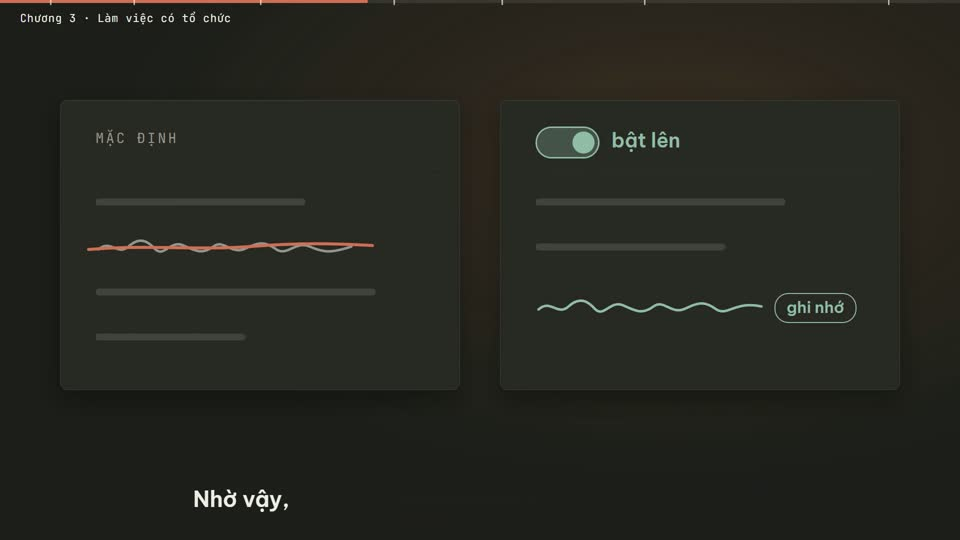 |
| 31 | [Trò chuyện ẩn danh](claude-intro-explainer/compositions/frames/31-tro-chuyen-an-danh.html) | ch3 | `screen@0-4.14, kinetic@4.14-5.14, screen@5.14-9, kinetic@9-11.3` | compose | _(private screenshot)_ |
| 32 | [Tóm tắt chương ba](claude-intro-explainer/compositions/frames/32-tom-tat-chuong-ba.html) | ch3 | `anchor@0-7.7, hub@7.7-10.18` | fixed-anchor-cycle (Adapt) | 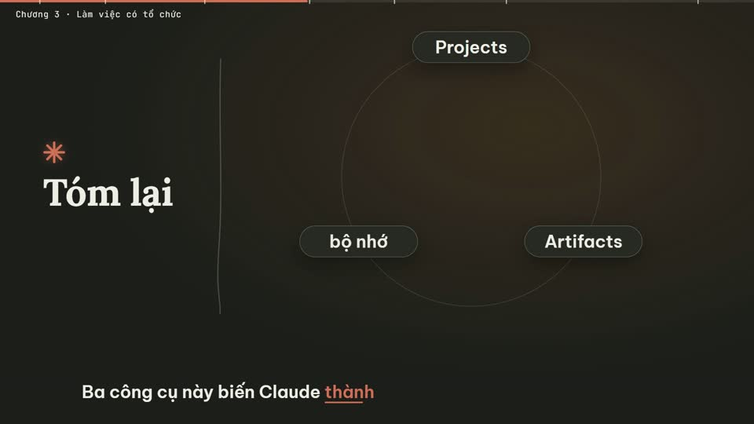 |
| 33 | [Kết nối và nghiên cứu](claude-intro-explainer/compositions/frames/33-ket-noi-va-nghien-cuu.html) | ch4 | `title@0-3.4` | titlecard-reveal (Adapt) | 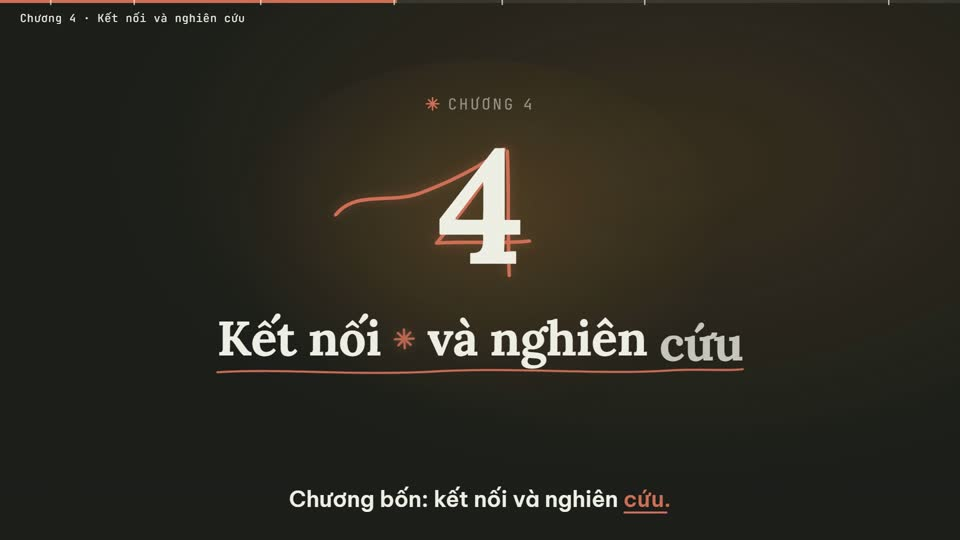 |
| 34 | [Connectors: cánh tay nối dài](claude-intro-explainer/compositions/frames/34-connectors-canh-tay-noi-dai.html) | ch4 | `kinetic@0-3.27, hub@3.27-9.38, split@9.38-12.68` | constellation-hub (Adapt) | 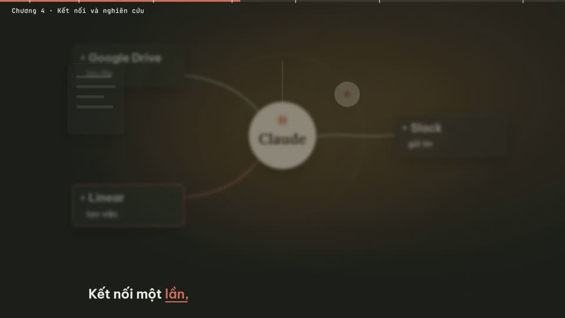 |
| 35 | [Bật một connector](claude-intro-explainer/compositions/frames/35-bat-mot-connector.html) | ch4 | `screen@0-6.93, kinetic@6.93-10.17` | compose | _(private screenshot)_ |
| 36 | [Không chỉ đọc, mà còn làm](claude-intro-explainer/compositions/frames/36-khong-chi-doc-ma-con-lam.html) | ch4 | `flow@0-8.38, cards@8.38-12.71` | agent-progress-theater (Adapt) | 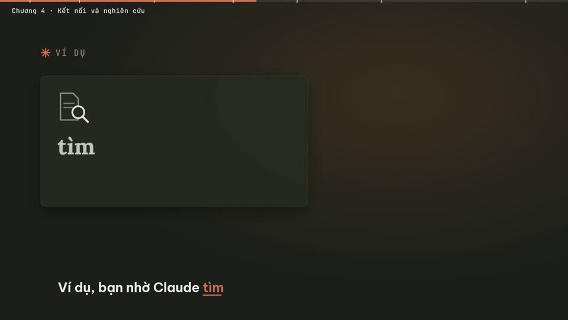 |
| 37 | [Research: nghiên cứu sâu](claude-intro-explainer/compositions/frames/37-research-nghien-cuu-sau.html) | ch4 | `kinetic@0-2.61, stat@2.61-7.38, zoom@7.38-9.59` | kinetic-type-beats (Adapt) | 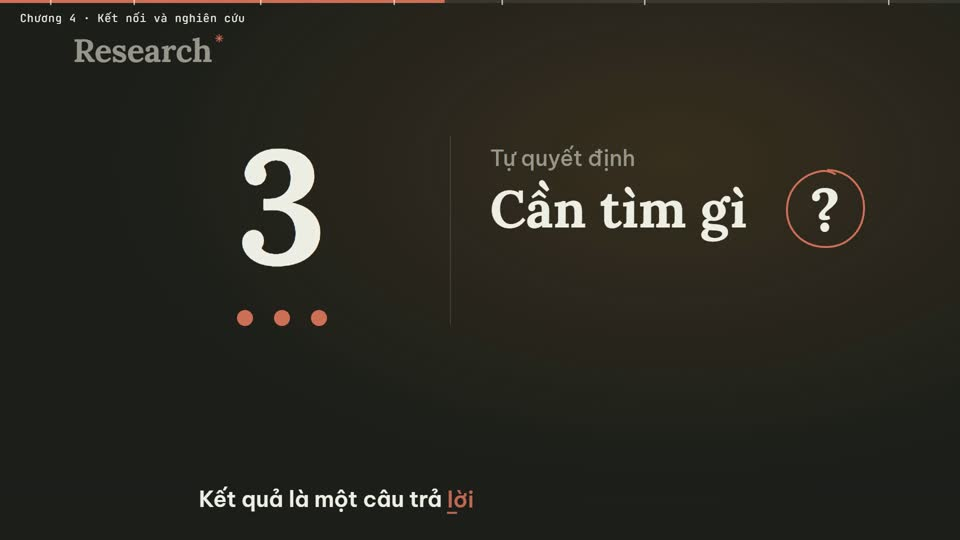 |
| 38 | [Bật Research](claude-intro-explainer/compositions/frames/38-bat-research.html) | ch4 | `screen@0-5.56, hub@5.56-10.53` | compose | _(private screenshot)_ |
| 39 | [Claude trong trình duyệt](claude-intro-explainer/compositions/frames/39-claude-trong-trinh-duyet.html) | ch4 | `metaphor@0-7.27, kinetic@7.27-10.83` | compose | 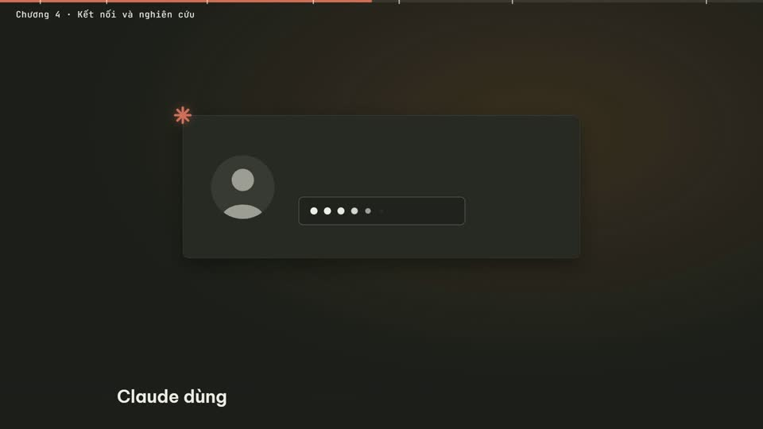 |
| 40 | [Trình duyệt hay ứng dụng máy tính](claude-intro-explainer/compositions/frames/40-trinh-duyet-hay-ung-dung-may-tinh.html) | ch4 | `split@0-8.39, zoom@8.39-11.71` | compose |  |
| 41 | [Cẩn thận lệnh ẩn](claude-intro-explainer/compositions/frames/41-can-than-lenh-an.html) | ch4 | `typewriter@0-5.34, flow@5.34-7.73, kinetic@7.73-10.58` | typewriter-reveal (Adapt) | 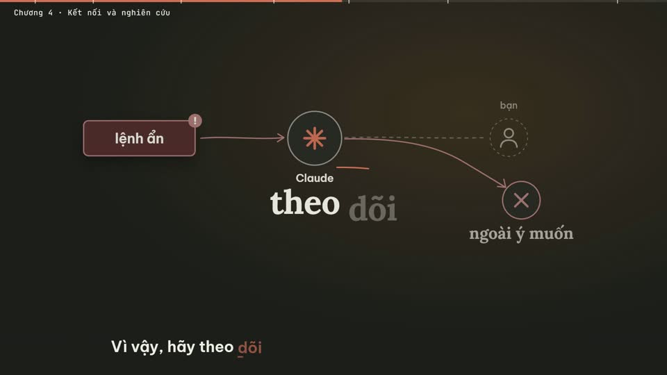 |
| 42 | [Tóm tắt chương bốn](claude-intro-explainer/compositions/frames/42-tom-tat-chuong-bon.html) | ch4 | `anchor@0-6.06` | fixed-anchor-cycle (Adapt) |  |
| 43 | [Nâng cao: Claude Code và nền tảng](claude-intro-explainer/compositions/frames/43-nang-cao-claude-code-va-nen-tang.html) | ch5 | `title@0-4.39` | titlecard-reveal (Adapt) | 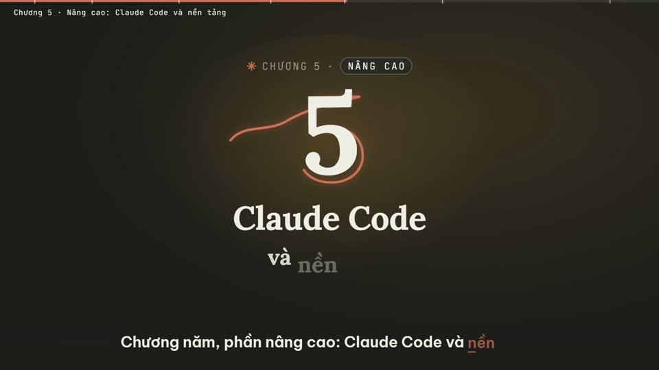 |
| 44 | [Ba câu hỏi cho mỗi điểm nổi bật](claude-intro-explainer/compositions/frames/44-ba-cau-hoi-cho-moi-diem-noi-bat.html) | ch5 | `kinetic@0-2.93, flow@2.93-9.91` | compose |  |
| 45 | [Claude Code trong terminal](claude-intro-explainer/compositions/frames/45-claude-code-trong-terminal.html) | ch5 | `terminal@0-4.9, cards@4.9-7.67, terminal@7.67-12.43, kinetic@12.43-15.75` | prompt-type-submit-generate (Adapt) | 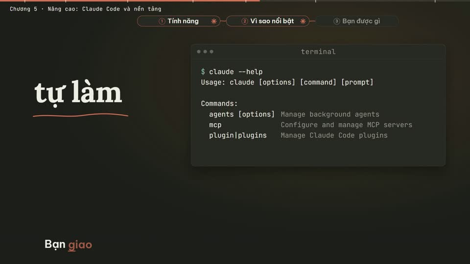 |
| 46 | [CLAUDE.md: bảng nội quy](claude-intro-explainer/compositions/frames/46-claude-md-bang-noi-quy.html) | ch5 | `metaphor@0-5, split@5-9.5` | compose | 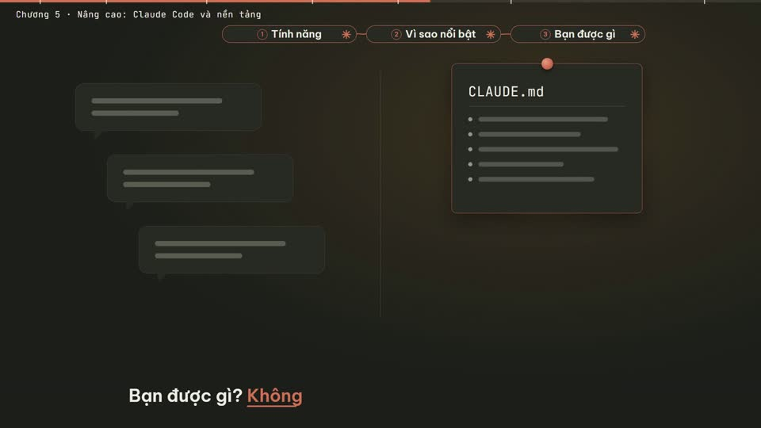 |
| 47 | [Skill: công thức làm việc](claude-intro-explainer/compositions/frames/47-skill-cong-thuc-lam-viec.html) | ch5 | `cards@0-7.4, typewriter@7.4-10.95` | grid-card-assemble (Adapt) | 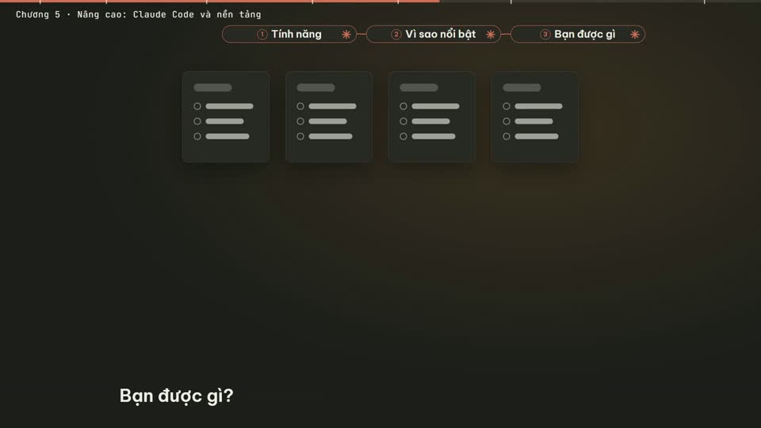 |
| 48 | [Subagent: trợ lý phụ](claude-intro-explainer/compositions/frames/48-subagent-tro-ly-phu.html) | ch5 | `hub@0-5.56, zoom@5.56-9.21` | constellation-hub (Adapt) | 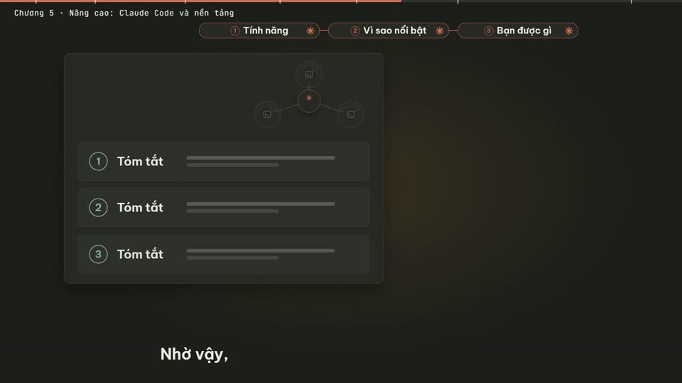 |
| 49 | [Hook: việc luôn xảy ra](claude-intro-explainer/compositions/frames/49-hook-viec-luon-xay-ra.html) | ch5 | `flow@0-6.35, kinetic@6.35-9.89` | compose | 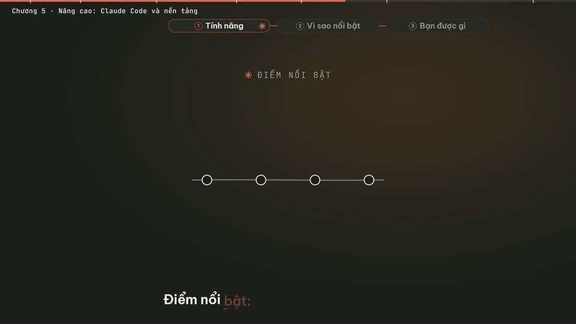 |
| 50 | [MCP: cổng kết nối chung](claude-intro-explainer/compositions/frames/50-mcp-cong-ket-noi-chung.html) | ch5 | `zoom@0-5.94, hub@5.94-10.22, split@10.22-14.88` | zoom-out-workspace-reveal (Adapt) | 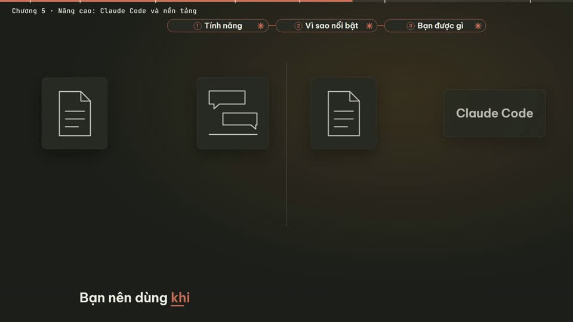 |
| 51 | [Plugin: đóng gói tất cả](claude-intro-explainer/compositions/frames/51-plugin-dong-goi-tat-ca.html) | ch5 | `metaphor@0-4.12, kinetic@4.12-7.87, journey@7.87-11.47` | compose | 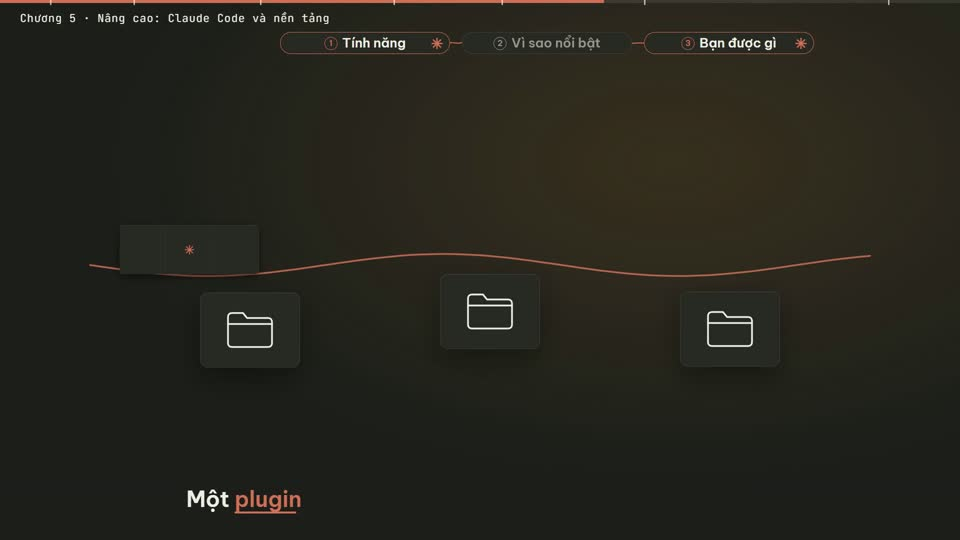 |
| 52 | [Claude Code trên ứng dụng máy tính](claude-intro-explainer/compositions/frames/52-claude-code-tren-ung-dung-may-tinh.html) | ch5 | `split@0-8.53, zoom@8.53-12.15` | compose | 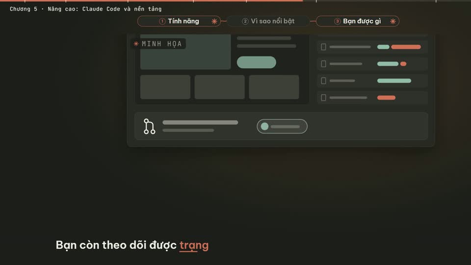 |
| 53 | [Nền tảng cho nhà phát triển](claude-intro-explainer/compositions/frames/53-nen-tang-cho-nha-phat-trien.html) | ch5 | `journey@0-9.02, zoom@9.02-12.78` | spatial-pan-stations (Adapt) | 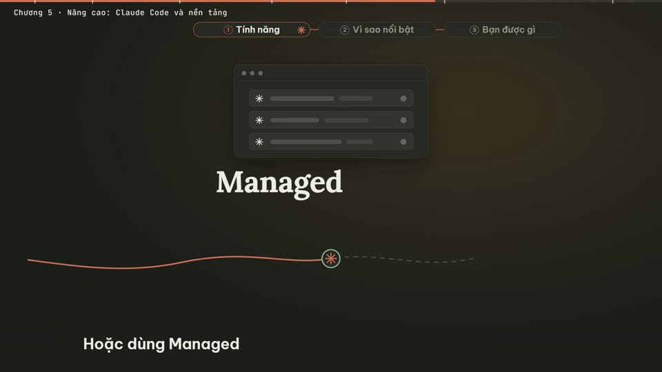 |
| 54 | [Tóm tắt chương năm](claude-intro-explainer/compositions/frames/54-tom-tat-chuong-nam.html) | ch5 | `anchor@0-5.42, kinetic@5.42-9.22` | fixed-anchor-cycle (Adapt) | 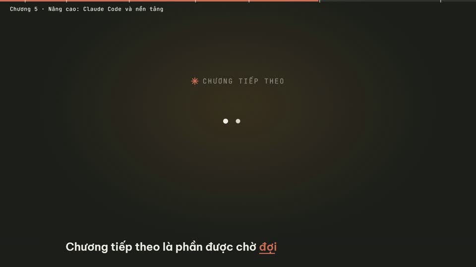 |
| 55 | [Mới nhất, tính đến 25/09/2026](claude-intro-explainer/compositions/frames/55-moi-nhat-tinh-den-25-09-2026.html) | ch6 | `title@0-5.94` | titlecard-reveal (Adapt) | 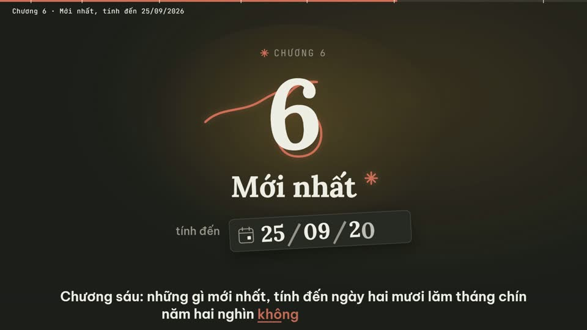 |
| 56 | [Một năm thay đổi rất nhanh](claude-intro-explainer/compositions/frames/56-mot-nam-thay-doi-rat-nhanh.html) | ch6 | `kinetic@0-1.89, journey@1.89-10.4, flow@10.4-13.79` | spatial-pan-stations (Adapt) |  |
| 57 | [Fable 5 và Mythos 5](claude-intro-explainer/compositions/frames/57-fable-5-va-mythos-5.html) | ch6 | `stat@0-3.99, split@3.99-10.4` | dataviz-countup (Adapt) | 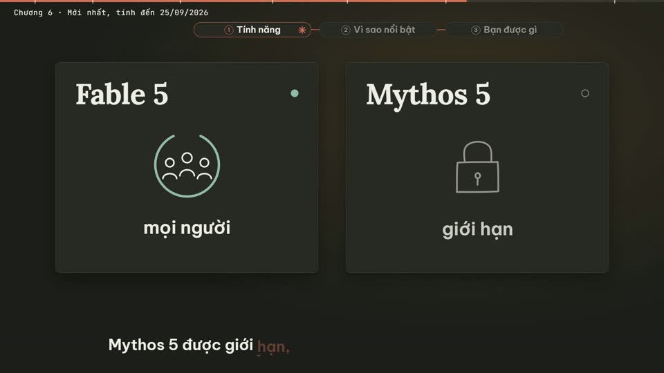 |
| 58 | [Cùng một model, khác lớp an toàn](claude-intro-explainer/compositions/frames/58-cung-mot-model-khac-lop-an-toan.html) | ch6 | `metaphor@0-6.15, kinetic@6.15-10.64` | compose | 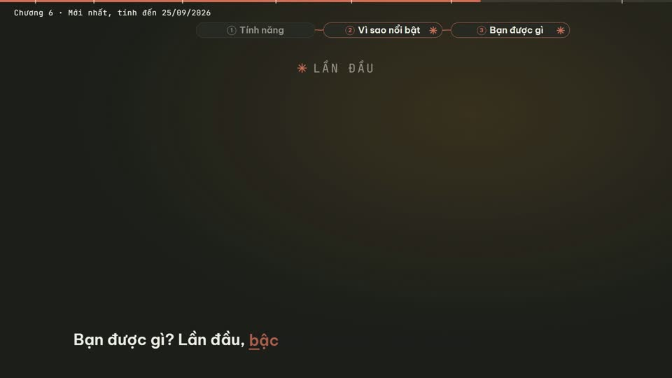 |
| 59 | [Claude Opus 5.5](claude-intro-explainer/compositions/frames/59-claude-opus-5-5.html) | ch6 | `typewriter@0-4.07, stat@4.07-8.95, split@8.95-12.2` | dataviz-countup (Adapt) | 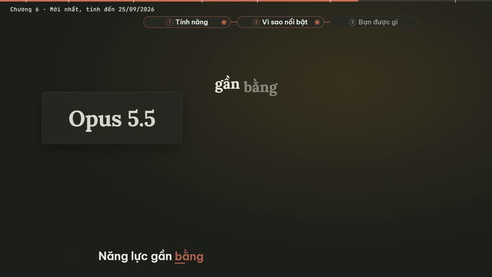 |
| 60 | [Trung thực nhất từ trước tới nay](claude-intro-explainer/compositions/frames/60-trung-thuc-nhat-tu-truoc-toi-nay.html) | ch6 | `kinetic@0-4.4, zoom@4.4-9.36` | kinetic-type-beats (Adapt) | 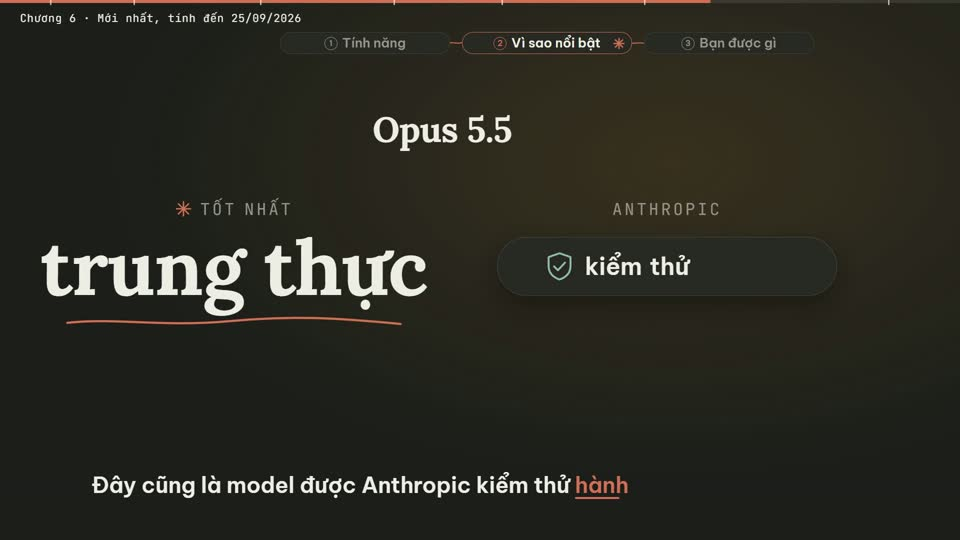 |
| 61 | [Cowork và chat gộp làm một](claude-intro-explainer/compositions/frames/61-cowork-va-chat-gop-lam-mot.html) | ch6 | `screen@0-4.88, split@4.88-6.87, flow@6.87-11.5` | compose | _(private screenshot)_ |
| 62 | [Claude Docs, Slides và Design](claude-intro-explainer/compositions/frames/62-claude-docs-slides-va-design.html) | ch6 | `cards@0-4.8, flow@4.8-8.35, kinetic@8.35-12.94` | grid-card-assemble (Adapt) | 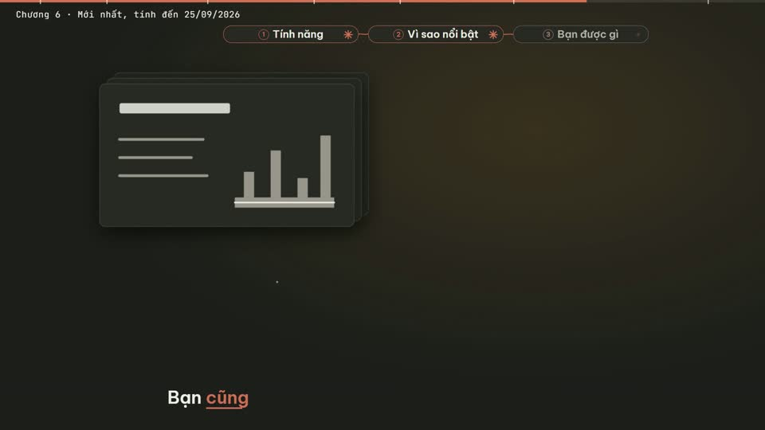 |
| 63 | [Slides ngay trong cuộc trò chuyện](claude-intro-explainer/compositions/frames/63-slides-ngay-trong-cuoc-tro-chuyen.html) | ch6 | `screen@0-4.24, hub@4.24-8.1, screen@8.1-12.07` | compose | _(private screenshot)_ |
| 64 | [Projects được thiết kế lại](claude-intro-explainer/compositions/frames/64-projects-duoc-thiet-ke-lai.html) | ch6 | `typewriter@0-3.54, flow@3.54-10.91, zoom@10.91-14.35` | agent-progress-theater (Adapt) | 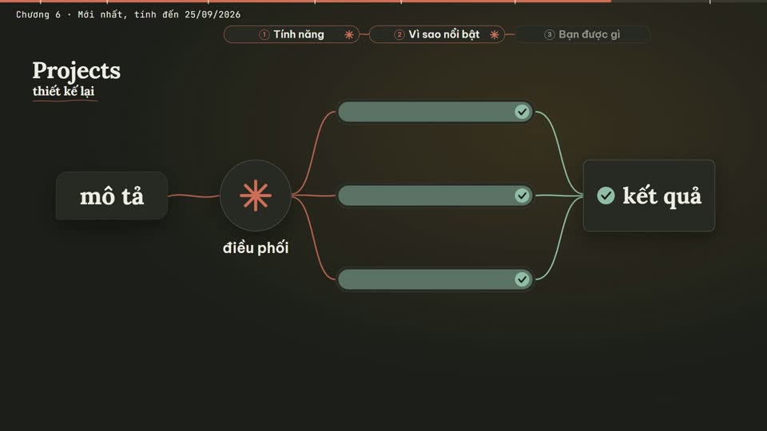 |
| 65 | [Một bộ nhớ chung cho cả dự án](claude-intro-explainer/compositions/frames/65-mot-bo-nho-chung-cho-ca-du-an.html) | ch6 | `metaphor@0-6.78, split@6.78-10.47` | compose | 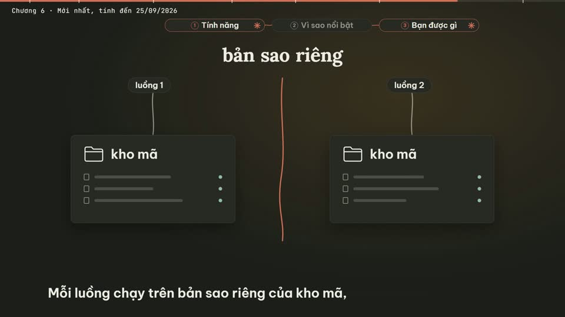 |
| 66 | [Cowork trong Chrome](claude-intro-explainer/compositions/frames/66-cowork-trong-chrome.html) | ch6 | `screen@0-5.84, journey@5.84-9.73` | compose | 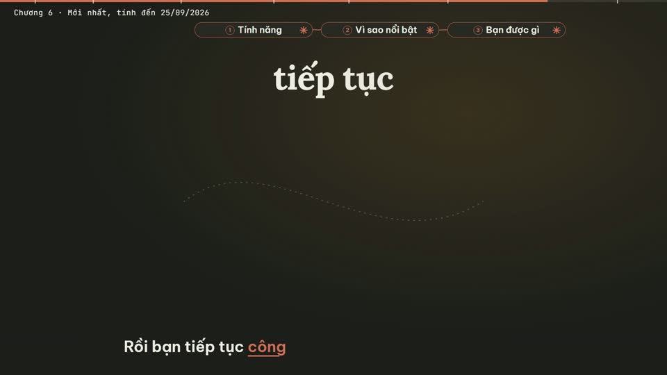 |
| 67 | [Connector có giao diện riêng](claude-intro-explainer/compositions/frames/67-connector-co-giao-dien-rieng.html) | ch6 | `zoom@0-4.6, cards@4.6-8, typewriter@8-11.4` | compose | 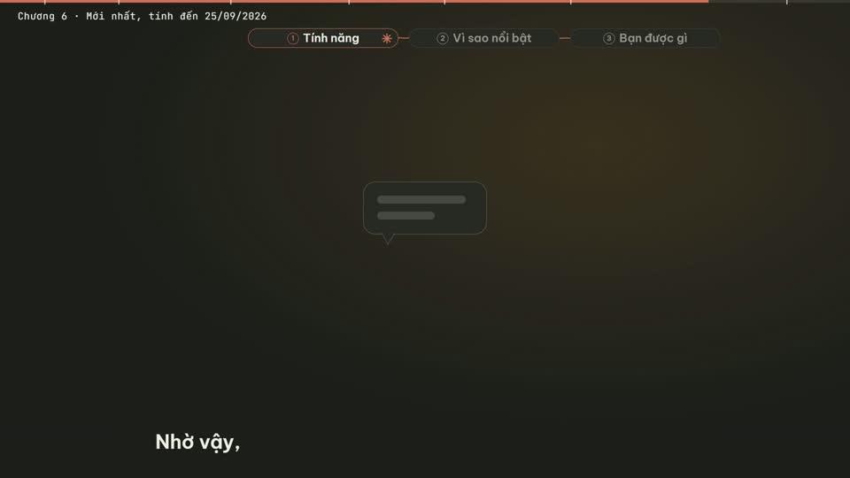 |
| 68 | [Claude Tag trong Slack](claude-intro-explainer/compositions/frames/68-claude-tag-trong-slack.html) | ch6 | `hub@0-7.85, cards@7.85-12.8` | constellation-hub (Adapt) | 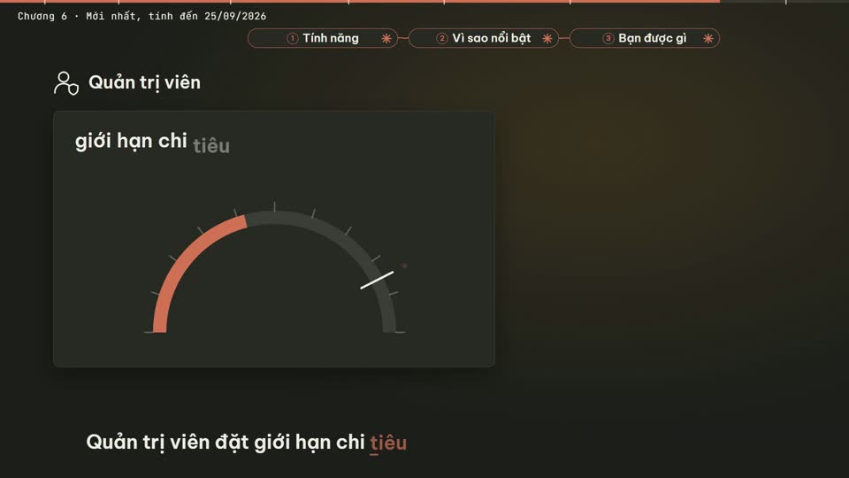 |
| 69 | [Claude Marketplace](claude-intro-explainer/compositions/frames/69-claude-marketplace.html) | ch6 | `kinetic@0-3.93, flow@3.93-7.29, stat@7.29-15.46` | dataviz-countup (Adapt) | 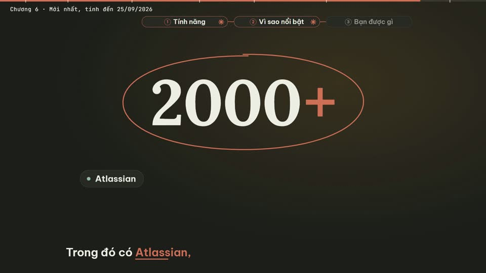 |
| 70 | [Hai chuẩn mở phía sau](claude-intro-explainer/compositions/frames/70-hai-chuan-mo-phia-sau.html) | ch6 | `split@0-4.75, zoom@4.75-9.16, kinetic@9.16-12.83` | compose |  |
| 71 | [Skill theo bạn xuống terminal](claude-intro-explainer/compositions/frames/71-skill-theo-ban-xuong-terminal.html) | ch6 | `flow@0-4.85, terminal@4.85-8.46, hub@8.46-10.91` | compose | 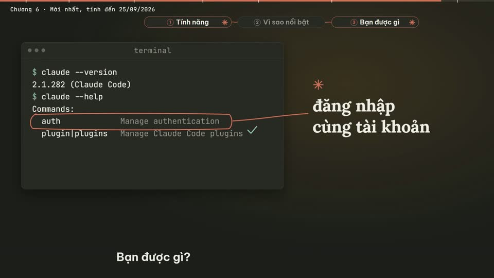 |
| 72 | [Mười tính năng trong một khung](claude-intro-explainer/compositions/frames/72-muoi-tinh-nang-trong-mot-khung.html) | ch6 | `stat@0-3.56, cards@3.56-11.29, zoom@11.29-17.03` | grid-card-assemble (Adapt) | 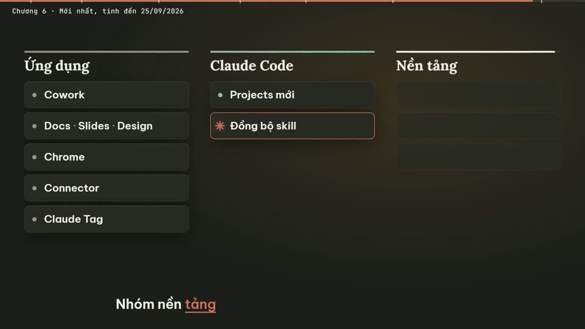 |
| 73 | [Tóm tắt chương sáu](claude-intro-explainer/compositions/frames/73-tom-tat-chuong-sau.html) | ch6 | `anchor@0-8.36` | fixed-anchor-cycle (Adapt) | 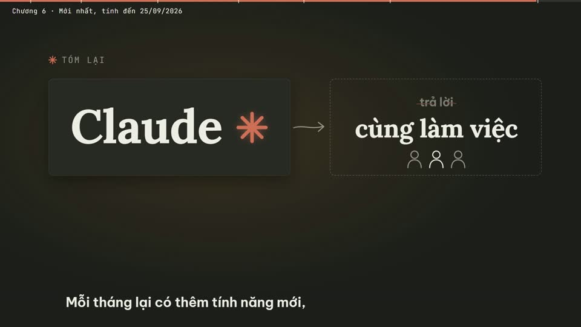 |
| 74 | [Dùng an toàn và tổng kết](claude-intro-explainer/compositions/frames/74-dung-an-toan-va-tong-ket.html) | ch7 | `title@0-3.98` | titlecard-reveal (Adapt) | 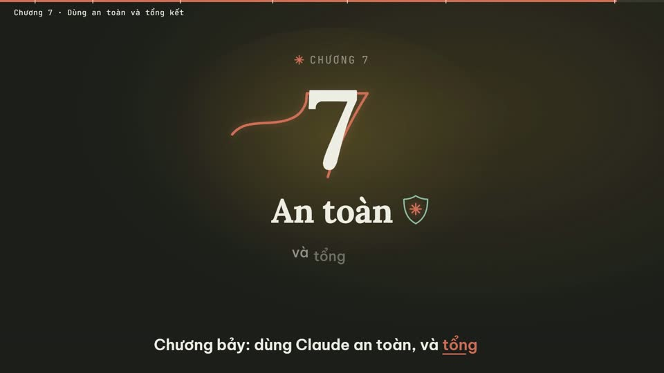 |
| 75 | [Lớp bảo vệ của Anthropic](claude-intro-explainer/compositions/frames/75-lop-bao-ve-cua-anthropic.html) | ch7 | `flow@0-8.3, kinetic@8.3-11.67` | compose |  |
| 76 | [Ba thói quen an toàn](claude-intro-explainer/compositions/frames/76-ba-thoi-quen-an-toan.html) | ch7 | `cards@0-6.51, zoom@6.51-10.26` | grid-card-assemble (Adapt) | 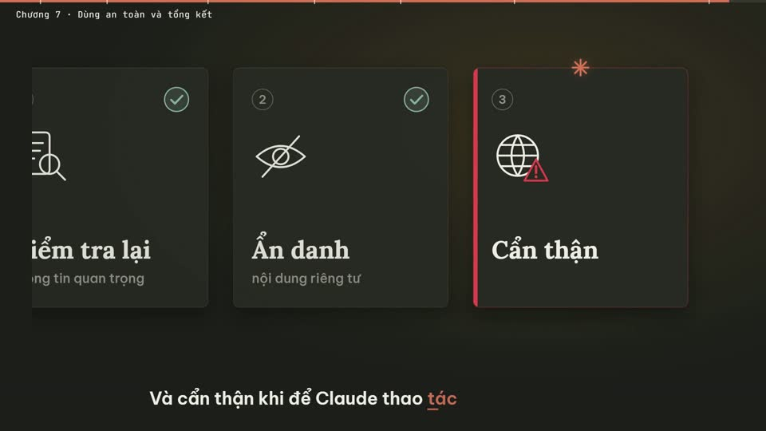 |
| 77 | [Chat ẩn danh khác gì?](claude-intro-explainer/compositions/frames/77-chat-an-danh-khac-gi.html) | ch7 | `kinetic@0-1.81, stat@1.81-4.75, metaphor@4.75-8.98, split@8.98-12.83` | compose | 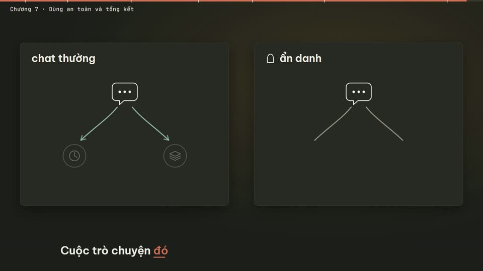 |
| 78 | [Hành trình của bạn hôm nay](claude-intro-explainer/compositions/frames/78-hanh-trinh-cua-ban-hom-nay.html) | ch7 | `journey@0-7.58, cards@7.58-11.18, metaphor@11.18-14.72` | spatial-pan-stations (Adapt) | 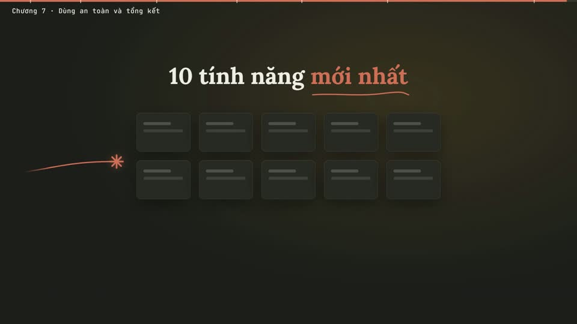 |
| 79 | [Bước tiếp theo](claude-intro-explainer/compositions/frames/79-buoc-tiep-theo.html) | ch7 | `anchor@0-8.79, kinetic@8.79-11.87` | fixed-anchor-cycle (Adapt) | 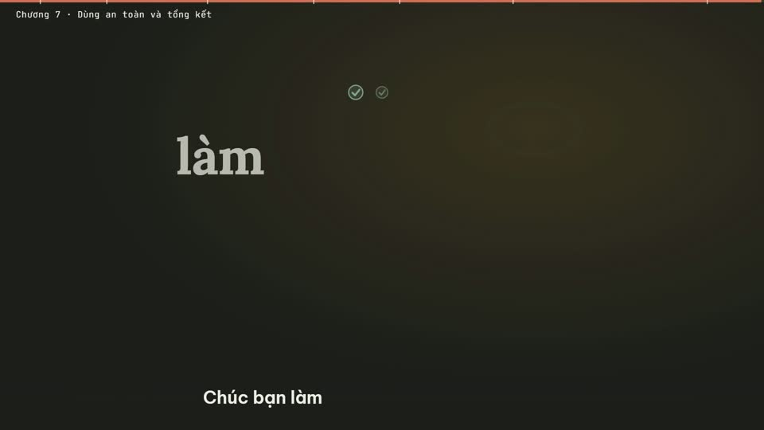 |
